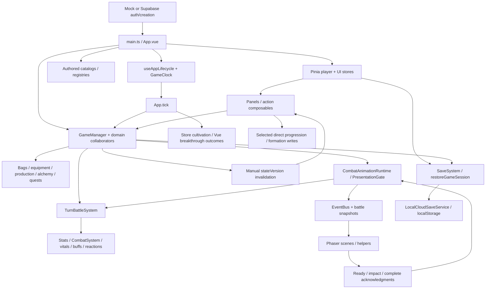
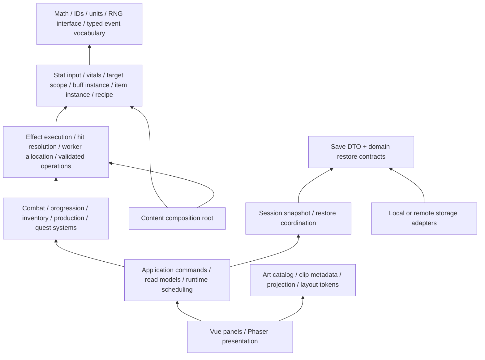

# Mission 0 — Whole-project architecture audit

Date: 2026-09-08. Baseline: 1f1a3a98f7d6661e3afecc6f1b684197276a85ee.

Worktree: E:/tutienidle/.agent-worktrees/mission-0-architecture-audit  
Branch: codex/mission-0-architecture-audit

This is the single audit deliverable for Misson0.md. No implementation mission was executed. Production code, tests, gameplay content, AGENTS.md and AstraDoctrine.md were not edited. The user's subsequent instruction makes AstraDoctrine.md the operating priority; the current Architecture Constitution remains the audit baseline. No commit, integration, push or deployment was performed.

Evidence convention: paths below are worktree-relative and line numbers refer to this baseline. **Executed** means a deterministic probe ran against current source, not that the entire player journey was tested. **Source** means the implementation and current callers establish the finding. **Conditional** means the path requires a stated configuration or API sequence. A proposed target is a recommendation, not a current requirement or implemented system.

Coverage: inventoried all 531 production TypeScript/Vue files under game/src, including 255 core, 43 data, 119 component, 31 composable, 45 Phaser/presentation, 18 service and 11 store files; inspected meaningful systems, mutation paths, adapters, consumers and representative tests across every mission domain. Also inspected Electron, SQL, build/test configuration, asset scripts/manifests and relevant existing documentation. This is whole-project system coverage, not a claim that every line or binary asset has been exhaustively proved correct.

Fresh verification in game/: type-check passed; build passed; Vitest passed **413 files / 2,841 tests** in 123.66 seconds. Build warned about large chunks. Tests emitted substantial translation/lifecycle/mock-error output while passing. No browser, packaged Electron, live Supabase or database migration execution was performed. Existing dependencies were exposed through an ignored node_modules junction; there was no dependency installation or manifest change.

The maintained combat reference named by AGENTS.md, docs/superpowers/specs/2026-09-07-turn-based-combat-reference.md, is absent at this baseline. No obsolete plan was substituted. Comments naming historical plans were treated as explanations to check against code, not governing requirements.

## 1. Executive diagnosis

TutienIdle has a substantial, useful foundation. It is not a collection of feature-local code with no architecture. Shared damage/mitigation calculators, equipment instance rules, typed content registries, buff pools, projected battle geometry, explicit action phases, measured inventory layout, tooltip/focus mechanisms and validated ink-wash assets already remove real complexity.

The dominant problem is **incomplete migration of authority**. New runtime paths reuse old types and selected helpers without carrying their full semantic obligations. A final stat snapshot is accepted as raw input; turn effects subtract HP beside the existing damage owner; a converter turns self buffs into physical enemy attacks; optional source/token arguments let current consumers silently omit required context. Outside combat, online/offline worker allocation implements the same rule differently, quest activation is hidden in a UI query, and progression outcomes remain owned by Vue composables.

These are not conclusions drawn from file size. Several are executable counterexamples despite the full unit suite being green:

| Counterexample | Result | Finding |
|---|---|---|
| Ordinary hit followed by lethal Ward-consumption bonus | HP 0, alive true, battle still fighting, no death event | AR-01 |
| Resolve strength-derived stats, then enter the turn recompute path without buffs | Attack 10 → 70 → 130 | AR-02 |
| Convert current water/earth self-buff specials | Physical ×1 enemy-target action; authored buff lost | AR-03 |
| All active production sites manually assigned below total capacity | Online worker allocation throws on an undefined auto site | AR-07 |
| Use the production decompose instance and request six workers | Worker count remains zero | AR-08 |
| Kill before opening quest UI, then kill after querying active quests | First kill ignored; later kill counted | AR-09 |

The test suite is strongest at individual mechanisms and accumulated regressions. Its weaker area is **real consumer composition**: what the adapter supplies, what the new executor omits, what a query initializes, and whether a UI-created system has the same configuration as the production instance.

Architectural assessment: **REQUEST CHANGES for the current baseline**, with a usable foundation worth preserving. Audit completion is not release readiness. The highest-leverage first implementation mission is to route turn bonus damage, Ward consumption and regeneration through the existing combat/vitals authority; section 20 defines exactly that mission. Stat semantics, worker allocation and skill conversion are also urgent, separate responsibilities.

## 2. Complete system inventory

The tables group files by actual responsibility rather than one row per class. Each row records purpose and input/output, mutable state, dependencies/consumers, existing and missing primitives, violations/duplication, intended responsibility and risk. State lifecycle detail is expanded in section 6; finding IDs point to full evidence in section 7.

### Application, infrastructure and persistence

| System / implementation | Purpose; inputs → outputs | Mutable state | Dependencies and current consumers | Primitives, boundary and target; risk |
|---|---|---|---|---|
| Bootstrap: game/src/main.ts, App.vue, router/index.ts | Register Vue/Pinia/i18n/directive, templates and runtime; entry action → playable session | App refs, GameManager instance, clock, stateVersion | Content catalogs, stores, boot/lifecycle, GameRoot | Composition root is appropriate. Starter grants and gameplay tick decisions exceed presentation responsibility (AR-13). Router uses hash history but has no routes; do not invent a routing migration. High |
| Boot lifecycle: composables/useBootFlow.ts, useAppLifecycle.ts | Auth/create/load outcome → boot stage, timers, save flush | Stage ref, in-flight guards, timer handles, essence flags | App, coordinator, clock, manager, DOM events | Explicit stage/teardown and idempotent timer start exist. Whole-session restore identity and resource lifecycle remain partial (AR-12/13). High |
| Runtime clock: core/idle/GameClock.ts, SpeedSettings.ts; App.tick; GameManager.update | Wall elapsed → simulation delta; fixed steps → domain advancement | Clock timestamps, battle accumulator/phase timing | App interval; production, buffs, alchemy, turn runtime | calculateOfflineTime is a useful primitive. There is no single update context shared by all time consumers (AR-13); clock domain units must remain explicit. High |
| GameManager: core/game/GameManager.ts and *Ops/System collaborators | Coordinate registry installation, player session, inventory, stage, progression and combat commands | Active player ref, battle/session maps, reward receipts, collaborators | Almost every domain; Vue composables/panels and Phaser bridge | Many methods correctly delegate. Detailed timed-effect/auto-farm rules and broad public access remain; repair identified responsibilities, not line count. High |
| Vue bridge: composables/useGameState.ts; App.provide | Plain manager + mutation notice → reactive UI recomputation | One stateVersion ref | Every bag/panel/action using manager | Framework-independent core is preserved. Manual bumpState after every command is a convention, not an enforced mutation notification (AR-13). Medium |
| Player store: stores/player.ts; core/player/Player.ts | Defaults, player commands, modifiers → persistent character and final stats | PlayerData, modifier buckets, restore caches | Domain functions, SaveSystem/coordinator; App and most UI | Reuses calculateStats and cultivation rules. Store also computes cultivation talent/timed bonuses; multiple domain writers act on the same exposed record. Stat/restore distinctions need repair (AR-02/12/13). High |
| UI/feedback stores: stores/ui.ts, uiFlagsPersistence.ts, notification.ts, actionFeedback.ts, error.ts, saveIssue.ts, offlineSummary.ts, worldAnnouncement.ts, breakthroughRequirement.ts | User selections/domain feedback → navigation, toasts, errors/dialogs | Transient UI flags/queues; selected automation preferences | App, shared chrome, panels | Appropriate presentation state. Automation preference persistence is separate from character save; some direct writes coexist with actions. Preserve separation, make mutation paths consistent (AR-13). Low/medium |
| Theme: stores/themeStore.ts, assets/themes, composables/useTheme.ts, game/support/themePhaserSync.ts | Theme preference → CSS and Phaser colors | Theme selection, subscriptions | Bootstrap, DOM primitives, scenes | Canonical tokens and bridge exist. Theme is a device preference, not gameplay authority. Low |
| Event bus: core/events/EventBus.ts; battle event types | Publisher event → synchronous handlers | Handler map | GameManager, passives, App and scenes | Small mechanism is useful. Caller-selected generic type is not tied to event name; exceptions propagate; gameplay and presentation share event names (AR-14). Medium/high |
| Save codec/storage: services/save/SaveSystem.ts, saveShapeValidation.ts, saveVersion.ts | Owner snapshots → validated JSON; stored JSON → classified load result | Storage keys, backup/import handoff | Player/store, local save adapter, settings/recovery UI | Version/shape classification and equipment preflight are strong. Snapshot is shallow except selected fields; broad DTO depends on concrete domain shapes (AR-12/15). High |
| Session restoration: SaveSystem.restoreGameSession; core/game/GameManagerSaveRestore.ts; player.restoreFromSave | Validated save → player, bags/managers and offline settlement | Multiple owners restored incrementally | Registered templates, player store, production/alchemy/auto-farm | Correct preflight-before-write order exists for equipment. No whole-session replacement/idempotency contract; additive restore and weak player identity differ (AR-12). High |
| Local “cloud” coordinator: services/cloudSave/* | Load/write revision → result and conflict recovery | Revision counter; localStorage save/revision | Player.save, App, settings and Electron flush | Service interface exists; factory always selects local adapter. Retry intentionally implements last-writer-wins; it is not a transactional multi-tab/cloud save guarantee (AR-15). Medium/high |
| Authentication: services/auth/*, services/supabase/* | Credentials/guest request → session | Stored session, service instance | AuthEntryScreen, character creation | Config-selected mock/Supabase adapters are real. Refresh/revocation and live deployment are not verified; no account-bound cloud gameplay save path (AR-15). High when enabled |
| Character creation: services/character/*; onboarding components; game/supabase/migrations/202608240001_online_auth_character.sql | Name, rolled talent, five attributes → character identity | Client roll identity/set; SQL rolls, characters, saves | Auth service, RPCs, App creation callback | Client validation exists; SQL demands three talents while current client demands one; SQL catalog/schema are stale relative to gameplay (AR-16). High when enabled |
| Electron: game/electron/main.ts, preload.ts; useElectronBridge.ts | Window/system events → renderer runtime and quit flush | Window, flush guards/listeners, IPC callbacks | BrowserWindow, player.save | Narrow context-isolated API and single-instance guard are good. Listener disposal and save-result acknowledgment are incomplete (AR-17). Medium |

### Gameplay, progression and world

| System / implementation | Purpose; inputs → outputs | Mutable state | Dependencies and current consumers | Primitives, boundary and target; risk |
|---|---|---|---|---|
| Stats: core/stats/* | Raw attributes and modifiers → capped/derived stats and labels | Mostly pure; modifier stacks | Player getter, equipment, combat, previews | One calculator exists; raw/final provenance is missing at its consumers (AR-02/05). High |
| Damage/vitals: core/combat/* | Hit, DoT, direct damage/heal → numbers, resource mutations, events/death | Entity vitals, lethal-intervention state | Turn combat, buffs, loot recovery | Armor/Resistance/Accuracy/Endurance/RealmPressure are good primitives. Existing authority is bypassed; hit contract responsibilities split (AR-01/04/06/18). High |
| Grid/targeting/gauge: core/battle/BattleGrid.ts, BattleLane.ts, BattlefieldRegions.ts, ActionTargetingSystem.ts, turn/ActionGauge.ts, TurnQueue.ts, AoeShape.ts | Positions, shapes, living actors and speed → target sets/order | Gauge; positions | Turn engine, preview, Phaser projection | Real stable geometry/order primitives. Participant speed/alive duplicate entity state (AR-05). Do not unify projected battle grid with inventory layout. High |
| Turn battle: core/battle/turn/TurnBattleSystem.ts, TurnSkillAction.ts, ResourceTurnHook.ts, WaveSpawnTrigger.ts | Participants/commands/ticks → declaration, impact, completion, waves | TurnBattle, participant cooldown/charge/resource state | GameManager, animation runtime, buffs/damage/reactions | Explicit phases are sound. Effects, content-policy branches and direct vitals work exceed orchestration (AR-01/03/04/06/18). High |
| Animation runtime: core/battle/turn/CombatAnimationRuntime.ts, PresentationGate.ts, TurnActionPresentationEvents.ts | Pending action/manual choice/ACK/time → calls into battle phases and visual events | Pending action token, phase, deadlines | GameManager and CombatScene | Runtime is separate from Phaser. Optional ACK identity and event ownership weaken it; one actual import cycle (AR-14/20/24). High |
| Persistent buffs: core/buff/* | Real-time effects + source/entity/time → buff instances/modifiers/DoT | BuffPool and timers | GameManager.update, persistent penalties/pills | Still live. Clock-independent formulas duplicate turn buffs (AR-19); retain separate time units. High |
| Turn buffs: core/battle/turn/TurnBuff*; data/buff/TurnBuffRegistry.ts | Turn definitions + source/target → instances, CC, modifier and trigger results | Per-participant source-indexed pool | Turn engine, reactions, formations/passives | Useful pool/registry/stack concepts. Source integration and shared rules incomplete (AR-06/19). High |
| Elements/reactions: core/element/*, turn/TurnReactionManager.ts | Element/ailment pairs → conversion, reaction damage and events | Buff changes, elemental resources | Active turn engine; element loadout UI | Wuxing/pair lookup are good primitives. Old ReactionManager is retained but not shown to be a second active app engine (AR-25). Medium/high |
| Skills/loadout: core/skill/*; data/skill/*; SkillToTurnSkillConverter.ts | Learned level/slots/specialization/content → effective skill and turn action | SkillManager, learned skills, cooldowns, passive stacks | UI, GameManager, save, turn executor | Loadout/progression primitives exist; Skill and TurnSkillDefinition are incomplete parallel semantic models (AR-03/18/25). High |
| Talents/passives: core/talent/*, core/skill/PassiveSystem.ts, data/talent/Talents.ts | Selected traits and gameplay events → modifiers/interventions/progression bonuses | Learned passive stacks, once-per-battle survival | Player/store, battle, cultivation, rewards | Many data-driven helpers are sound. Concrete content IDs and event timing leak into generic owners (AR-14/18). High |
| Cultivation/realm: core/cultivation/*, core/realm/realmSystem.ts, data/realms/realm.ts | Cultivation gain/requirements → progress and minor advancement | Player realm/level/cultivation | Store, App.tick, realm UI | Requirement formula is canonical. Application/store still owns economic sequencing and some bonus calculations (AR-13). Medium/high |
| Major breakthrough/tribulation: core/tribulation/TribulationDirector.ts, useTribulation.ts, useBreakthrough.ts | Attempt + battle result → realm/path/penalty/talent consequences | Player foundation/opportunity/cooldown state, encounter | GameManager, App tick, realm dialogs, TribulationScene | Combat challenge primitive exists; consequential progression outcome remains in Vue (AR-10). High |
| Body/meridian/realm passives: core/realm/BodyRefinementSystem.ts, MeridianSystem.ts, RealmPassiveSystem.ts | Essence/resources/gates → persistent tiers/modifiers | Player tier progress, grants | GameManager, App essence arrival, panels | Domain helpers exist. Presentation arrival controls when body investment is attempted (AR-14); outcome rules should stay domain-owned. Medium/high |
| Paths/nodes: core/player/CultivationPathSystem.ts, KiemYSystem.ts; core/progression/*; data/progression/* | Chosen route, insight, prerequisites → purchased levels, loadout modifiers | Player nodeLevels, IDs, path/route | GameManager and skill/path UI | Typed nodes, registry and prerequisite/aggregation logic exist. Avoid replacing with universal progression engine; repair actual ID policies separately (AR-18). Medium |
| Techniques: core/technique/*, data/technique/* | Learned/equipped technique + total progression → available roles/tier | TechniqueManager | GameManager, store aggregation, scripture UI, save | Manager/system/data boundaries useful. Full authored objects are persisted, creating hydration policy debt (AR-12/25). Medium |
| Artifacts: core/artifact/*, data/artifact/* | Realm/path/insight → normalized artifact growth/presentation | Player artifact state; retained combat runtime | GameManager, artifact panel/HUD, save | Progression helpers remain useful. Legacy Battle-based activation is inert in current turn adapter; do not claim active artifact combat coverage (AR-25). Medium/high |
| Companions/party formation: core/companion/*, core/game/PartyFormation.ts, FormationPlacement.ts, data/companion/* | Persistent companion/placement → fresh combatants and valid placement | Player companion levels/formation loadout; ephemeral entities | GameManager, TranPhapPanel, turn battle | Canonical leveling/construction/placement exist. UI directly commits persistent loadout and test grants; separate draft from command (AR-11). Medium |
| Enemy/boss construction: core/enemy/*, data/enemy/*, StageWaveSystem.ts | Template/stat input/stage → normalized enemy and participant | Enemy registry instances; wave records | GameManager, turn engine, loot and visuals | EnemyStatInput and trigger/everyNth mechanisms deserve preservation. Reward lookup copies and battle entity have distinct roles; document instead of merging blindly. Medium |
| Stages/zones: core/stage/*, data/stage/* | Realm/unlocks/current stage → effective waves, enemy counts, next stage | Stage progress, active encounter | GameManager, StageSelectPanel, loot/auto-farm | ProgressStageResolver/EffectiveWaves/EffectiveEnemyCount are real primitives. Preserve content gates; legacy broad Battle query/reward types need narrowing (AR-25). Medium |
| World map: core/world-map/* | Hex coordinates, zone metadata → validated topology/layout | Map model if instantiated | WorldMapValidator/HexLayout tests; no complete live map journey established | Geometry exists; distinguish library/validated content from a deployed interactive world-map flow. Low |
| Rewards/loot: core/reward/*, core/game/BattleLootSystem.ts, HiddenBeastSystem.ts | Defeated enemy/stage context + rolls → inventory, insights, summary | Summary, granted-enemy IDs, beast progress | GameManager, quest hooks, result UI | Reward scaling/drop rules useful. Battle-shaped shim and receipt duplication remain (AR-25); keep orchestrator, narrow its input. High |
| Auto-battle/auto-farm: GameManager repeat/progress/perfect-farm methods; useAutoRetryCountdown.ts; combat result components | Preference + result/deadline → restart/next stage/offline rewards | UI mode/countdown and player autoFarmStage | GameManager, result panels, save restore | Real modes are distinct. Some sequencing remains UI-driven; offline outcome calculation is a separate path needing characterization, not assumed combat replay equivalence (AR-13). High |
| Quests: core/quest/*, data/quest/quests.ts, GameManagerQuestOps.ts | Eligibility + kill/collect/day/claim → progress and rewards | QuestManager active/completed/reset timestamp | QuestPanel query, GameManager event hooks, save | Claim validation is domain-owned. Query-created activation makes gameplay depend on visiting UI (AR-09). High |

### Inventory, equipment and production

| System / implementation | Purpose; inputs → outputs | Mutable state | Dependencies and current consumers | Primitives, boundary and target; risk |
|---|---|---|---|---|
| Item identities/quality/grade: core/item/*, core/profession/*, data materials/equipment/pills | Authored identity/axes → validated definitions, naming and gates | Static registries | Bags, operations, drops and UI | ItemQuality and ProfessionGrade are different axes; accepted legacy ItemGrade has other consumers. Do not merge by similar labels. Low/medium |
| Material/pill bags: core/material/*, core/pill/PillBag.ts, core/inventory/StackLimits.ts | Add/remove requests → stored stacks and overflow | Maps/stack amounts | Production, vendor, crafting, rewards, save | Central mutation methods exist; add is partial-delivery, not atomic. Compound trades must honor that contract (AR-22). Medium/high |
| Equipment instances/bag: core/equipment/EquipmentInstance.ts, EquipmentBag.ts, EquipmentRollPrimitives.ts | Template/roll/cap → instance identity, affixes, forge budget, overflow dissolution | Instance records, bag map | Drops, equipment ops, save/UI | Strong instance model. getAll exposes mutable records; callers must not fabricate accepted operation results (AR-21/12). High |
| Equipment slots/stats: EquipmentSlotManager.ts, EquipmentSlotState.ts, EquipmentSystem.ts, EquipmentStatPolicy.ts | Item/slot/enhancement → canonical modifier set | Slot bindings/enhance levels; derived modifier cache | GameManager/EquipmentOpsSystem, store, tooltip | Existing instance+slot distinction is meaningful; previews usually reuse policy. Preserve canonical calculation (AR-24 is a naming-layer import issue, not duplicate combat formula). Medium |
| Enhance/refine/forge/wash: EnhanceCurve.ts, RefinementBalance.ts, EquipmentOperationCostCatalog.ts, EquipmentWash.ts, EquipmentOpsSystem.ts | Quote/payment/selection → item improvement or rejection | Item forge points, affixes, slot enhancement, pending refine preview | Equipment hall, GameManager | Refine has protected pending-preview mechanics. Wash accepts caller-supplied results without equivalent binding (AR-21). Repair operation ownership before making generic UI cost components. High |
| Dissolve/quality: EquipmentDissolve.ts, ItemQualityBalance.ts, TinhHoaMaterial.ts; DecomposeSystem.ts | Selected items/materials → essence/quality changes | Bag contents; decompose clock/workers | Equipment hall/GameManager | Canonical dissolve formulas exist. Decompose worker wiring is dead (AR-08); it is a different operation from instant equipment dissolution. High |
| Equipment sets/sockets/talisman/formation items: core/equipment/SocketedModifierItem.ts; core/talisman/*, core/formation/* | Authored modifiers/socket capability → equipment effects where still supported | Residual instance/socket fields or static definitions | Registries/retained types; save writes empty talisman/formation bags | No evidence for a new live set-bonus authority or full talisman-production loop. Treat live residuals separately from retired bags; do not resurrect old crafting requirements (AR-25). Low/medium |
| Buildings: core/building/*, GameManagerBuildingOps.ts, data/building/buildings.ts | Requirements/cost/level → building instances, storage/capacity/unlocks | BuildingManager instances | App starter grants, building UI, production/worker systems, save | Domain/manager/registry split useful. Correct capacity must reach every worker consumer (AR-08); avoid per-panel capacity formulas. Medium |
| Gathering/resource production: core/production/ProductionSystem.ts, ProductionCatalog.ts, ProductionBalance.ts, ProductionTypes.ts | Site/realm/seed/deadline/worker allocation → materials/events | Site levels, active/manual/worker cycles | GameManager.update/restore, ProductionPanel | Seeded cycle reward settlement exists. Two allocation algorithms disagree and one crashes (AR-07); shared allocation primitive is missing. High |
| Worker capacity/allocation: WorkerCapacity.ts, GameManagerBuildingOps.ts, worker UI | Building/player capacity and assignments → allocation | Player autoWorkerCapacity; assignment map; per-site slots | Production and intended decompose workers | Capacity primitive exists; allocation/assignment/persistence ownership incomplete (AR-07/08). High |
| Alchemy/pills: core/alchemy/AlchemySystem.ts, GameManagerAlchemyOps.ts, core/pill/PillSystem.ts, data/alchemy/* | Recipe/cost/room/deadline/RNG → jobs, pills/effects | Jobs, pill bag, persistent timed effects | GameManager ticks/restores, pill-room UI | Recipe/job/settlement mechanisms useful. UI success-rate calculation is a duplicate authority; current retired talent avoids a proven live bonus mismatch (AR-23). Medium |
| Vendor/economy: core/economy/VendorSystem.ts, VendorBalance.ts, TuLinhTranBalance.ts | Quantity/quote/currency/capacity → inventory exchange or timed bonus | Bag contents/player timed effects | VendorPanel, GameManager | Quotes/balances exist. Partial-delivery rollback is not transactional (AR-22); preserve separate trade/content policy. Medium |
| Exploration/crafting status | Current production sites/recipes replace old exploration/crafting names in several UI keys | No old ExplorationManager/CraftingManager runtime identified | ProductionPanel remains behind historical exploration navigation key | Distinguish renamed UI from duplicate engines. No new systems should be designed from obsolete exploration/crafting plans. Low |

### UI, Phaser, assets and tooling

| System / implementation | Purpose; inputs → outputs | Mutable state | Dependencies and current consumers | Primitives, boundary and target; risk |
|---|---|---|---|---|
| UI foundations: common/GameButton.vue, OverlayPanel.vue, ConfirmModal.vue, TabBar.vue, primitives/*; SlotView/SlotTypes | Semantic props → composed DOM interactions | Focus, selection, failed-image refs | Nearly all feature panels/HUD | Slot/Button/Tooltip/Modal/Bar/StatRow already exist. Tabs/chips selection semantics partial (AR-28). Low/medium |
| Tooltip/dialog mechanics: useTooltip.ts, directives/tooltip.ts, useDialogFocus.ts | Owner/ref/content/open → one tooltip or controlled focus lifecycle | Singleton tooltip; per-dialog focus state | Tooltip component, shared dialogs/slots | Useful canonical mechanisms. DOM/Phaser rendering need not be unified. Low |
| Container measurement: useBagGridLayout.ts, usePanelPagination.ts, useBagPagination.ts, core/ui/* | Container rectangle/count → grid/page capacity | ResizeObserver, sizes and page | Bags, codices, equipment operation lists | Exists. Distinct width-first slot and height-first list adapters are justified. Formation preview bypasses shared geometry principle (AR-26). Medium |
| Domain action/read-model adapters: useEquipmentActions/Tooltip, useBattleActions, useLoadoutActions, useTurnBattleInfo | Domain results + input → UI commands/read models | Local selection/preview; stateVersion dependency | Panels and GameManager | Many canonical previews are used. Direct progression/formation mutations and manual invalidation remain (AR-10/11/13). Medium/high |
| Phaser hosting: components/game/PhaserCanvas.vue | Mounted container + manager → Phaser.Game/scenes and resize bridge | Game instance, observers, subscriptions | App/GameRoot, lazily imported scenes | Bootstrap cleanup/error handling has tests. Keep primary host; separate preview lacks equivalent generation ownership (AR-27). High |
| Home scenes: game/scenes/MainScene.ts; DongFuScene.vue and building components | Player profile/theme/building descriptors → home scene | Sprites, backdrop caches, listeners | DOM owns much scenery; MainScene player/fallback | Do not rebuild deleted duplicated scenery. Static poses are current behavior, old atlas comments are not requirements. Medium |
| Combat views: CombatScene.ts; game/scenes/combat/*; game/support projection/layers/VFX | Battle snapshots/events → sprite/HUD/VFX/death playback | Scene/helper maps, tweens, generations | PhaserCanvas and animation runtime | No direct authoritative HP mutation found in inspected scene paths. Helpers still share private-like scene maps (AR-29); incomplete token wiring (AR-20). High |
| Tribulation views: TribulationScene.ts, tribulation overlay | Challenge events → lightning/vitals rendering | Render resources/subscriptions | GameManager and domain director | Presentation role is sound; progression defect is in composable outcome, not scene rendering. Medium |
| Formation preview: TranPhapPanel.vue, TranPhapCombatPreviewScene.ts, CombatGridViewHost.ts | Local placement + viewport → sprites and drop targets | Separate Phaser.Game; draft | Reuses CombatGridView | Good reuse, but two geometry authorities and async instance race (AR-26/27). Medium/high |
| Character/enemy art: PlayerVisualProfiles.ts, EnemyArt.ts, CombatAnimationSet.ts, CombatPreload.ts, SpriteBodyAnchor.ts | Art records/clip keys → loading, anchors, animations/fallback | Phaser texture/animation caches | Home, combat, preview | Real metadata primitives exist. Duplicate enemy lists and incomplete ingestion contract (AR-30/31). Medium |
| Ink-wash/building asset pipeline: assets/inkWashUi.ts, inkWashAssetValidation.ts, game/scripts/build-ink-wash-assets.mjs; building ImageMagick scripts | Approved masters/manifest → checked raster layers, atlases and review matrices | Build artifacts only | DOM and Phaser nine-slice/layer consumers | Strong maintained mechanism; preserve. Integrate validation of new character assets rather than replacing pipeline. Medium |
| Asset router: game/scripts/route-assets.mjs; asset-drop/README.md | Encoded filename → destination move | Filesystem outputs | Manual asset import | Destination containment is not validated (AR-31); historical target examples are stale onboarding debt. Medium |
| Verification/build tooling: package.json, vite.config.ts, tsconfig*.json, eslint.config.js, tests/e2e/*, *.test.ts | Source/config/fixtures → compiled artifacts and assertions | Test fixtures/caches/artifacts | Developer workflow | Broad suite exists; no general import/vitals-write enforcement. Source-string tests and mock construction miss ownership defects (AR-32/33). High for confidence, not a separate gameplay owner |

## 3. Current architecture map

The arrows here describe runtime/data composition, not import direction.



Important qualifications: the store and GameManager share the same mutable PlayerData reference after setActivePlayer; they are not cleanly isolated copies. Enemy templates/registered instances versus battle combatants are different roles, not automatically duplicate HP owners. The real turn loop is active; retained legacy helpers/types do not establish a second active BattleSystem loop. Supabase authentication does not imply Supabase gameplay saving: the latter factory is always local.

## 4. Current dependency map

An in-memory TypeScript AST inventory parsed imports/exports, including Vue script blocks. It found 2,085 static resolved edges; 1,261 remain after excluding explicit type-only imports. Dynamic imports, event names, callback closure captures and object references are not counted. This is a reproducible structural inventory, not a full bundler reachability proof.

No direct Vue, Pinia or Phaser package imports were found under core/**. That is a substantial positive boundary. Runtime syntax has one strongly connected component:

```text
GameManager
  -> CombatAnimationRuntime
  -> TurnActionPresentationEvents
  -> GameManager.COUNTDOWN_TOTAL_TICKS
```

The last edge is a runtime constant import at TurnActionPresentationEvents.ts:6. It should depend on a neutral timing contract, not the orchestrator that owns it.

| Dependency kind | Current evidence | Meaning and target |
|---|---|---|
| Compile-time runtime import | core/equipment/EquipmentNaming.ts:7 → composables/slots/normalizeSlotRank.ts | Domain naming reaches upward for a pure grade-rank helper; move the semantic rank authority downward or place presentation naming with presentation |
| Compile-time type import | CombatAnimationRuntime.ts:6 → game/support/CombatAnimationSet.ts | Core runtime phase vocabulary comes from art/presentation layer; lower severity than a runtime formula dependency, but direction is wrong |
| Compile-time type imports | GameManager.ts:187 / GameManagerSaveRestore.ts:23 → services/save/SaveSystem.ts | Save DTO lives with storage/DOM utilities; not a runtime cycle by itself. Separate DTO/codec only when repairing session boundary |
| Content import | TurnBattleSystem → data/skill/TurnReactionPathSkills; CombatSystem concrete survival buff ID | Generic resolution knows named content; use definition-provided execution/intervention policies |
| Runtime callback | GameManagerSaveRestore → closures for capacity/auto-farm; CombatAnimationRuntime → phase getters/calls | Some are correct inversion-of-control contracts. Judge responsibilities and captured mutable state, not callback count |
| State dependency | Scene helpers take CombatScene and write its maps | A type-only import can still mean broad runtime authority over another object's state |
| State dependency | Vue panel/composable → PlayerData writes | Presentation commits progression/formation rules rather than invoking the owner |
| Event dependency | Presentation emitter sends attack; PassiveSystem consumes attack | Names conceal gameplay coupling; independent of static import acyclicity |
| Application dependency | GameManager and service access exposed through stores/useGameManager | Convenient access does not authorize the caller to mutate every exposed subsystem |

Type-only cycles also appear among combat entity/grid/enemy types, skill/trigger types, artifact/path types, UI flag types and scene/helper types. Do not rank all of them as runtime initialization defects. A type graph is useful for vocabulary placement; an object-mutation or event graph is needed for authority.

## 5. Target dependency map

Arrows below mean “may depend on.” The target is a small number of repaired contracts, not a new enterprise framework.



Presentation emits typed commands and generation-scoped acknowledgments; gameplay emits committed facts. Runtime owns deadlines/phase progression, while domain authorities determine outcomes. Persistence serializes domain snapshots and requests restoration; it should not become the owner of progression rules. Read-only projections derive speed, alive state and UI values from their authority rather than retaining independently writable duplicates.

Concrete lower-layer repairs: mandatory vitals outcome path; raw/final stat contract; supported skill-effect compilation; shared worker allocation; explicit quest activation lifecycle; session-scoped restore identity; validated preview commit capability; complete existing ACK tokens. Keep the existing calculators, registries, primitives and systems where their responsibilities already fit.

## 6. State ownership map

“Allowed writer” means the logical domain authority through its API; pure domain functions may legitimately mutate a caller-provided record under an explicit contract. It does not require putting every field in one giant class.

| State | Creator / current authority and writers | Readers | Reset path | Persistence | Correct authority / allowed writers; violations |
|---|---|---|---|---|---|
| Player identity/base attributes | createDefaultPlayer/store; App creation assigns name/talents/stats | UI, stat/progression systems | New store/session | GameSave.player | Character creation/progression commands; App should apply an owner-produced initialization result (AR-13) |
| Realm/cultivation/foundation/opportunity | Store + CultivationSystem + useTribulation/useBreakthrough + GameManager | Requirements, content gates, UI, combat adapter | New character; outcome-specific changes | PlayerData | Cultivation/realm outcome authorities; Vue outcome rules violate boundary (AR-10/13) |
| Player raw stats/modifier buckets/finalStats | Store getter; equipment owner produces modifiers; realm/talent/system writers | Combat start, previews, UI | Rebuild on restore/equip; new battle snapshot | Base/modifier arrays persisted | Stat input/modifier provenance owner; final value stored as combat base violates calculation contract (AR-02) |
| HP/MP/Ward/alive | Adapters initialize; CombatSystem/vitals and turn direct writes | Damage, queue, rewards, scenes | Fresh combatants; battle exit/repeat behavior | Battle vitals not persisted | Combat/vitals authority; direct bonus/regen/consumption bypass (AR-01) |
| Effective speed / participant speed | Adapter copies; turn recomputes entity stats only | Gauge, queue, preview | New participant | Ephemeral | Effective stat projection; no separate mutable speed authority (AR-05) |
| Gauge/cooldown/charge/resource counters | TurnBattleSystem, TurnSkillAction/resource hooks | Manual HUD/runtime, action selection | New participant; repeat retains specified participant state | Ephemeral | Turn/action/resource owners; preserve explicitly characterized repeat policy |
| Turn buffs | Per-participant TurnBuffPool; TurnBuffSystem/reactions/survival callbacks | CC/stat/damage/render consumers | Battle construction/cleanup; explicit expiration | Ephemeral | Buff owner and typed operations; duplicated semantics/source omission (AR-06/19) |
| Persistent buffs/timed effects | BuffSystem pool and PlayerData.persistentTimedEffects; GameManager/pills/tribulation | Stats, cultivation, penalties | Deadline expiry/new session | Player timed effects persist; do not assume every runtime BuffPool is serialized | Persistent-effect authority; separate seconds/deadline semantics from turn count |
| Learned skills/loadouts/passive stacks | SkillManager/System and PassiveSystem modify Skill instances | Effective converter, stats, UI | Learned restoration; passive reset at battle start | Full learned skill objects in save | Skill progression vs runtime passive state explicitly separated; authored-data snapshot drift (AR-03/18/25) |
| Node levels/IDs/path/route | NodeSystem/CultivationPathSystem via manager; some UI commands | Modifiers, skill selection, gates | New character / permitted respec | PlayerData | Existing progression owner; preserve prerequisites and one level authority |
| Artifact progress | ArtifactProgression/manager and breakthrough composable | Artifact panel, normalization, HUD | normalizeArtifactProgress/new character | PlayerData.artifact | Artifact progression owner; retained combat runtime not an active authority (AR-25) |
| Companions / formation loadout | Player defaults; leveling/gacha helpers; TranPhapPanel direct writes | Placement/companion combat constructor, UI | New character; local draft reset | PlayerData | Companion acquisition and formation commit authorities; UI draft remains local (AR-11) |
| Materials/currency/pills | Bag registries/maps; operations, rewards, restore via add/remove | Inventory/quotes/requirements/save | Bag clear/new manager; restore currently adds | ID/amount snapshots | Bag mutation owner plus compound-operation atomicity; partial-delivery rollback issue (AR-22) |
| Equipment instances/affixes/forge budget | Roll primitives/EquipmentBag/System; wash commit accepts external array | Equip/stats/tooltips/dissolve/save | Bag/new manager/operation updates | Full instances | Equipment operation owner; validated paid preview capability (AR-21) |
| Slot assignment/enhancement | EquipmentSlotManager/System | Stat calculation/paperdoll/ops | restoreSlots/new manager | equipmentSlots | Existing slot owner; callers request equip/unequip/enhance |
| Buildings/worker capacity/assignments | BuildingManager/Ops; PlayerData capacity; manager assignment map | Production/UI/save restoration | Building restore/derived capacity refresh; assignment lifecycle partial | Buildings/capacity persist; assignment map not represented in GameSave | Worker allocation authority with explicit assignment save/reset policy (AR-07/08) |
| Production cycles/worker slots | ProductionSystem | Settlement/UI/save | restoreStates/new cycle | Seed, deadline, realm, workerCycles persisted | Production owns cycles; one allocation function shared online/offline (AR-07) |
| Decompose workers/deadline/output | DecomposeSystem with capacity zero at production construction | GameManager.tick/DecomposeTab | Local instance lifecycle | No decompose settings/timing snapshot found | Worker/production command contract; zero-capacity dead wiring (AR-08) |
| Alchemy jobs | AlchemySystem | Tick/settlement/UI/save | restoreJobs/settle/removal | alchemyJobs | Existing alchemy owner; quote and execution should share success policy (AR-23) |
| Quest active/completed/day state | QuestManager; QuestSystem query creates entries, events increment, daily reset removes | Quest UI, claims, save | Daily reset / restore | quests snapshot | Quest lifecycle activates eligible quests independently of UI reads (AR-09) |
| Stage completion/perfect clear/auto-farm | GameManager/reward/progress methods; player record | Stage selection, gates, offline rewards | New character/start/stop mode | PlayerData | Stage-progress/auto-farm authority; UI owns preference only, not authoritative restart accounting |
| Battle session/wave/reward receipts | GameManager/TurnBattleSystem; reward Set and shim flags | Runtime, loot, scene/read models | Start/stop/repeat | Ephemeral, except committed rewards/progression | Battle lifecycle plus reward receipt contract; broad legacy casts obscure this (AR-25) |
| Playback token/phase/deadline | CombatAnimationRuntime | Scene bridge/manager/manual input | resetPendingState/new action/phase | Ephemeral | Runtime only; scene must ACK captured generation tokens (AR-20) |
| Sprites/tweens/helper maps | Scene plus helper classes mutate shared maps | Render/update/cleanup | Scene shutdown/clear; helpers partly depend on scene cleanup | None | Each stable presentation mechanism owns its resource lifecycle (AR-29) |
| Formation preview game/draft/geometry | Panel async watcher; scene fixed constants; DOM fixed cells | Preview sprites and drop handlers | Close/unmount destroys only referenced game | Draft transient; committed loadout persists | Per-generation resource owner and one measured projection (AR-26/27) |
| UI flags/focus/tooltips/pages | UI store, component/composable state | DOM/scene chrome | Close/unmount/new session | Selected device preferences only | Existing UI owners; keep them separate from game progression |
| Save snapshot/restore identity | buildGameSave, player cache, manager additive restore | Storage adapters and restore callers | New coordinator/store; local reset | Save/revision/backup keys | Whole-session restore transaction and detached value snapshot; inconsistent identities (AR-12/15) |
| Auth/session/revision | Auth/session service; cloud coordinator independent of auth | RPCs and local save calls | Logout/reset/load | Browser session storage and local save keys; remote tables when enabled | Account/session boundary must be explicit; current auth and local save are separate products (AR-15/16) |

## 7. Architecture violation register

Priority follows the mission: P0 correctness/foundation risk; P1 major ownership/boundary problem; P2 missing mechanism or architectural friction; P3 lower-priority debt. Priority is not a claim of a production security incident. Confidence below 80 is excluded. Migration difficulty and regression risk are separate: a short patch can have high behavioral risk.

### AR-01 — P0 — Turn effects bypass damage/vitals completion

**Evidence / observed behavior — executed, confidence 100:** TurnBattleSystem.ts:891 calls CombatSystem for the ordinary hit, then :910 and :919 subtract consumption damage directly from currentHp; :920 clears Ward. Its :673 regeneration also writes HP directly. Completion checks entity.alive at :1048. CombatSystem.ts:111 already exposes a direct-damage path, :467 resolves death/survival, and EntityVitalsSystem.ts:36 owns vitals changes. A target starting at HP 100 receives ordinary damage 1 and a lethal Ward burst: HP becomes 0, alive remains true, battle remains fighting, death count is 0, and the only vitals event reports HP 99/killed false.

**Law / cause / owner:** A2–A5 and A7; raw entity fields are treated as an alternative damage API. CombatSystem must own damage/death policy and EntityVitalsSystem resource mutation/observations. Reuse existing direct-damage semantics and add the minimum Ward-consumption operation needed. “True damage” does not justify skipping death, survival or events.

**Migration:** medium; regression risk high. Cover lethal/nonlethal ailment and Ward consumption, survival interception, regeneration limits, event totals and exactly-once rewards. Existing consumeDamage tests mainly assert high-HP subtraction/consumption, so they miss the violated outcome invariant.

### AR-02 — P0 — Final stat output is passed back as raw stat input

**Evidence / observed behavior — executed, confidence 100:** useBattleActions.ts:34 passes player.finalStats; stores/player.ts:142 calls calculateStats; GameManager.ts:2682 passes that result to playerToCombatEntity; Player.ts:409 stores it as baseStats. TurnBattleSystem.ts:726 → TurnStatsRecompute.ts:14 → StatCalculator.ts:288 derives attribute modifiers again. Fixture raw attack 10 and strength 100 yields finalized attack 70, then 130 with no turn buffs.

**Law / cause / owner:** A2/A9/A11. The same Stats type denotes authored input, resolved static output and effective battle output. StatCalculator remains the formula authority, but its input contract is not represented. Preserve raw inputs and modifier provenance, or introduce a precisely defined already-resolved-base operation; do not blindly strip attributes or multiply a final snapshot.

**Migration:** medium/high; regression risk high across every stat consumer. Capture real store → adapter → first turn behavior, temporary attribute buffs, equipment percentage pools, expiry and max-vitals consequences. This is a bounded repeated derivation from a fixed snapshot, not evidence of unbounded per-turn accumulation.

### AR-03 — P0 — Active skill conversion silently changes authored semantics

**Evidence / observed behavior — executed, confidence 100:** GameManager.ts:2334/:2337 converts Pháp Tu specials/ultimates. SkillToTurnSkillConverter.ts:19–22 takes the first damage and debuff effects and defaults missing damage to physical ×1; :37 omits self/ally target scope. Current Skills.ts:1475 water special thanh_tuyen_duong_linh and :2007 earth special dia_tru_thua_thien are self buffs, selected by current chain mappings at :2289. Both convert to a single-target physical action with no authored buff; the turn engine selects an opposing target.

**Law / cause / owner:** A1/A2/A8/A9/A12. A permissive projection is acting as a semantic compiler without checking capability coverage. The skill execution owner needs explicit target scopes and supported ordered effects, or a rejected unsupported conversion. Evaluate existing SkillEffect/SkillAction vocabulary before creating a third parallel model.

**Migration:** high; regression risk high. Inventory every currently selected skill and specialization; characterize intended behavior, then migrate one build vertically. Other unrepresented effects are capability gaps to examine, not automatically established player bugs. Do not redesign balance/content during compilation repair.

### AR-04 — P1 — Turn hit calls omit critical policy and ignore resolution results

**Evidence / observed behavior — executed critical probe, confidence 100:** TurnBattleSystem.ts:866/:883/:891 calls resolveActionHit with three arguments. CombatSystem.ts:139 defaults critical to false; its rollCritical at :226 is not used by this path. With criticalRate 1, rollCritical returns true while the turn damage event remains critical false. The turn caller then appends target IDs and dispatches hit-related effects without consuming the returned DamageResult.

**Law / cause / owner:** A2/A5/A11/A12. Caller obligations formerly handled by ActionImpactSystem were lost in cutover. One authoritative hit operation should decide/return landed, dodged, critical, damage and death information; downstream effects and presentation consume that result.

**Migration:** medium; regression risk medium/high. Test guaranteed hit/miss/critical and action-effect gating. Avoid copying random rolls into three callsites while leaving ownership ambiguous. The exact consequences of every ignored-result hook still need individual characterization.

### AR-05 — P1 — Queue speed is a stale copy of effective combat speed

**Evidence / observed behavior — executed, confidence 100:** TurnBattleAdapter.ts:42 copies entity.stats.speed into participant.speed. TurnBattleSystem.ts:726 updates only entity.stats; :501/:509 and ActionGauge.ts:18 use participant.speed. A +100% buff gives stats speed 200 but queue speed 100 and gauge increment 100. Boss enrage content changes speed in data/buff/buffs.ts:818/:830/:842.

**Law / cause / owner:** A2/A3/A9. Queue input became an independently writable derived value without a refresh contract. Effective combat stats must own speed; gauge state remains queue-owned. Participant.alive also mirrors entity.alive, but has explicit synchronization and is not the same reproduced failure.

**Migration:** medium, alongside AR-02's stat contract; regression risk high for CC, enrage and ordering. Define when buffs alter effective stats, then verify gauge and order preview consume the same value.

### AR-06 — P1 — Turn DoT omits its source context

**Evidence / observed behavior — executed, confidence 100:** TurnBattleSystem.ts:670 does not pass resolveSource to TurnBuffSystem.update (:215). TurnBuffSystem.ts:249 therefore supplies no source to DoT damage. CombatSystem.ts:430 needs it for metal penetration and :452 for poison recovery. A living source present in battle with poisonRecoveryPercent 1 stays at HP 500 while its wood DoT deals 10.

**Law / cause / owner:** A2/A5/A11/A12. An optional collaborator silently disables required authored behavior. A typed battle entity resolver must supply live source context with an explicit dead/removed-source policy; CombatSystem continues to own mitigation/recovery.

**Migration:** low/medium; regression risk medium. Characterize living, dead, removed and self source cases; compare actual turn execution with the damage owner, not just a direct buff-system test.

### AR-07 — P0 — Worker allocation crashes online and diverges offline

**Evidence / observed behavior — executed, confidence 100:** ProductionSystem.ts:303–344 assigns manual sites, filters them out of autoSites, then distributes remaining capacity without checking that autoSites is nonempty. One auto-restarting site, capacity 3, manual assignment 1 throws “Cannot read properties of undefined (reading 'activeWorkerSlots')”. GameManager.update invokes this path at :3346; ProductionPanel.vue:235 exposes manual assignment. Offline allocation at ProductionSystem.ts:505–525 distributes spare capacity across all active sites instead. With capacity 6 and A=4/B=1, online gives the remainder to unassigned C while offline gives it to A.

**Law / cause / owner:** A2/A9/A11. A stable workforce allocation rule was copied into settlement implementations. Introduce one pure allocator; both settlement paths consume its result. Define idle capacity when no eligible unassigned site exists rather than silently inventing another allocation rule.

**Migration:** medium; regression risk high because the exception aborts the shared update invocation before later systems advance. Test zero/all-manual/mixed/overcommitted cases, ordering, restoration and real GameManager wiring. The current workers test at :162 claims parity but its offline assertion only checks settlement >= 0.

### AR-08 — P1 — The active decomposition instance can never receive workers

**Evidence / observed behavior — executed configuration probe plus source wiring, confidence 100:** GameManager.ts:474 constructs DecomposeSystem with autoWorkerCapacity 0. DecomposeSystem.ts:54/:66 stores it immutably; its settings clamp to that value. DecomposeTab.vue:27 uses this instance, yet :107 advertises a separate maximum of six. GameManager.ts:3394 ticks it, but no capacity update/replacement caller exists. Requesting six workers returns settings with zero. Its component test creates an independent capacity-six system.

**Law / cause / owner:** A1/A3/A9/A12. A third worker model was added without connecting the real building capability/allocation owner. Reuse the workforce authority, keep processing state with DecomposeSystem, and define settings/reset/persistence contracts. GameSave has no decomposition state.

**Migration:** medium after the allocator rule is settled; regression risk medium/high. Explicitly establish whether this feature shares the production pool and whether offline processing is intended. Fixing a dead connection does not authorize adding a new offline feature.

### AR-09 — P1 — Querying quests activates gameplay

**Evidence / observed behavior — executed and current UI traced, confidence 100:** QuestSystem.ts:64 calls ensureActive inside getActiveQuests; event handlers at :216/:258 only visit active entries. Daily reset removes them (:200; QuestManager.ts:98). The only production caller of GameManager.getActiveQuests is QuestPanel.vue:44; OverlayPanel.vue:36 gates its slot with open. A kill before the query produces no active progress; after querying, a kill counts; after daily reset, kills again do not count until queried.

**Law / cause / owner:** A3/A7/A11. A read API hides activation and there is no independent lifecycle reconciliation. QuestSystem must activate eligible quests at boot, eligibility transition and daily reset; UI queries must be read-only.

**Migration:** small/medium; regression risk medium. Test unopened UI, normal kills/collections, daily rollover and load. Preserve intended counting-from-activation semantics; do not retrospectively credit every item already owned.

### AR-10 — P1 — Vue owns permanent tribulation consequences

**Evidence / observed behavior — source, confidence 100:** useTribulation.ts:97–99 dispatches outcomes; :118–120 changes realm/level/cultivation, :132 foundation, :146–153 specific talents, :180 cultivation penalty, :189 currency, :193 injury and :200 an irreversible opportunity flag. App.tick calls the outcome check.

**Law / cause / owner:** A3–A7. TribulationDirector provides encounter results but no headless owner commits the progression consequences, so the composable absorbed them. Introduce a domain outcome application command; GameManager coordinates related owners, and Vue displays a typed result.

**Migration:** medium/high; regression risk high. Characterize victory/defeat/repeated checks, path/foundation/talent transformations, equipment/artifact effects and load. The old major-realm branch in useBreakthrough.ts:50–77 is currently unreachable because CultivationSystem refuses that transition; do not label it a second live outcome engine.

### AR-11 — P2 — Formation draft commits bypass a formation command

**Evidence / observed behavior — source, confidence 100:** TranPhapPanel.vue:173–177 directly assigns persistent formationLoadout. Its :162 companion push is explicitly development test content, not a proved reward/payment exploit. Existing FormationPlacement/PartyFormation/CompanionCombat already encode meaningful domain rules.

**Law / cause / owner:** A3/A7/A10. Local draft ownership is appropriate; accepted persistent placement needs a domain command that validates membership, uniqueness and legal cells. A companion acquisition command is appropriate when that production flow is implemented; do not add gacha merely because pure helpers exist.

**Migration:** small/medium; regression risk medium. Preserve draft cancel/confirm behavior, save shape and battle construction; test invalid/stale roster selections at the real command boundary.

### AR-12 — P1 — Save/restore has inconsistent identity and snapshot semantics

**Evidence / observed behavior — executed, confidence 100:** stores/player.ts:322 uses lastSavedAt|cultivation as the entire restore identity, :325 skips repeated identity, :339 shallowly assigns saved player data. Two different saves with those two equal fields but different name/skillInsight leave the first name and insight in place. GameManagerSaveRestore.ts:100 onward adds material stacks (:169 onward) without replacing the whole session: applying the same five-material save twice yields ten. buildGameSave at SaveSystem.ts:524 shallowly copies player and retains nested objects; changing live baseStats.strength after snapshot changes the saved snapshot from 1 to 101. Quests alone are explicitly detached and tested.

**Law / cause / owner:** A2/A3/A11/A12. Component-local idempotency patches do not define a session restore transaction. A snapshot must be a value at a declared point in time; a restore must have explicit replacement/once-per-session identity. Do not “fix” this with more fields added to the identity string.

**Migration:** medium/high; regression risk high. Decide one supported restore entry point, preflight all needed references, restore owners coherently and settle offline once. Test retries, changed same-timestamp payloads, nonempty managers, nested mutations during async retry and failure partway through restoration. Ordinary fresh-manager boot is covered and is not claimed universally broken.

### AR-13 — P1 — Application/manager glue still owns several domain policies

**Evidence / observed behavior — source, confidence 95:** App.vue:255 onward drives manager update, cultivation, automatic breakthrough, body investment and outcome checking; :371 onward installs starter skills/materials/buildings. stores/player.ts:156 onward computes talent/timed cultivation economics. GameManager.ts:1133 owns attribute investment, :1213 path starter/route decisions, :1536/:1584 persistent effect merge/expiry, :1601 cultivation boost purchase, :1660 technique modifiers and :2792 technique insight. useGameState.ts:9–17 requires every mutating action to remember bumpState.

**Law / cause / owner:** A3–A7/A11. These are independent reasons to change, not one “large file” finding. Missing complete commands/queries leave the application and manager as default rule owners. Move only an authorized responsibility to its existing character/path/technique/timed-effect owner; let runtime supply a consistent time context and command completion publish invalidation.

**Migration:** separate small vertical slices; aggregate difficulty medium/high, risk varies by domain. Do not schedule a blanket App/GameManager rewrite or treat plain core state as a reason to make the entire engine Vue reactive. A one-second stateVersion fallback is not proof of immediate command/UI consistency.

### AR-14 — P1 — Presentation events influence progression timing; gameplay events are mixed with playback

**Evidence / observed behavior — source, confidence 100:** BattleLootSystem.ts:383–388 emits an essence particle; CombatScene.ts:1605–1624 emits arrival immediately on a missing visual source or when stream playback completes. useAppLifecycle.ts:110–128 stores booleans, and :302–304 uses a 2,000 ms timeout measured from the latest emission. App.vue:310–320 then calls investBodyRefinement; GameManager.ts:1798–1804 consumes material and BodyRefinementSystem.ts:137–144 changes tiers/stat modifiers. Thus rendering completion selects the timing of real progression. Repeated emissions can postpone fallback; booleans coalesce arrivals. Those latter scenarios were not browser-reproduced.

A related P2 coupling: TurnActionPresentationEvents.ts:35 emits attack; runtime :209/:306 emits it in presentation-driven actions, whereas headless :311 / GameManager.ts:3518 resolves without it. PassiveSystem.ts:70/:140 subscribes and mutates passive stacks. Current attack passive content has a callable grant path but its normal progression reachability is unproved; this is not a demonstrated early-game passive failure.

**Law / cause / owner:** A2/A3/A7 and P17's timing principle. Runtime/domain scheduling should own reward investment, with explicit correlation if delayed progression is intended. Gameplay owns committed action events; presentation owns playback signals. Preserve product timing deliberately rather than silently changing it.

**Migration:** medium; regression risk high for progression/event ordering. Compare presentation on/off/failure, bursts of rewards, multiple arrivals, repeated actions and interrupted sessions. EventBus's generic payload parameter is not a name-bound event schema.

### AR-15 — P2 — Authentication and local save are separate unfinished contracts

**Evidence / observed behavior — source and configuration-conditional, confidence 100:** AuthServiceFactory and CharacterCreationServiceFactory select Supabase when configuration is present, but CloudSaveServiceFactory.ts:5 always constructs LocalCloudSaveService. That adapter reads one unscoped SAVE_KEY and a separate revision key. CloudSaveCoordinator.ts:24 onward intentionally reloads revision and retries a stale snapshot, implementing last-writer-wins. The revision read/check/two-key write is not an atomic cross-tab transaction. No remote gameplay save adapter exists in the inspected source.

**Law / cause / owner:** A3/A11/A12. An interface named cloud save is not a completed account/session save capability. Keep the current local behavior explicitly bounded; remote persistence needs an account-bound session and server concurrency contract when authorized. Do not redesign the intentional local conflict policy as an audit “fix.”

**Migration:** medium/high only if enabling online gameplay saves; risk high. Test auth identity to character/save identity, logout/account switch, same-account concurrent writers and snapshot immutability. No live account data or deployed behavior was inspected.

### AR-16 — P1 conditional — Checked-in server creation contract disagrees with the client

**Evidence / observed behavior — source, confidence 100:** CharacterCreationService.ts:8 requires one talent. The only SQL migration requires three at :54 and :150, defaults realm to pham_nhan at :49 while current gameplay uses mortal, and seeds a different talent catalog. SupabaseCharacterCreationService.ts:66 sends an empty initial save with the current schema version.

**Law / cause / owner:** A2/A9/A12. Client/content changes did not migrate the executable server contract or add parity checks. A shared creation contract/version boundary must govern the client, RPC validation and initial save.

**Migration:** medium; regression risk high when online mode is enabled. Validate migration/schema and RPC contract in a disposable database before wiring live accounts. This proves checked-in source incompatibility; the deployed database may differ and was not queried.

### AR-17 — P2 — Electron subscriptions and quit-flush acknowledgment have incomplete ownership

**Evidence / observed behavior — source, confidence 95:** preload.ts installs ipcRenderer listeners but returns no unsubscriber. useElectronBridge.ts registers them after each successful boot with no lifecycle disposal; App calls it after an awaited boot. Its quit handler awaits player.save but does not inspect a non-ok result, then always notifies flush complete. main.ts uses completion or a 2-second timeout to close.

**Law / cause / owner:** A3/A11. Registration has no matching lifetime contract, and “attempt finished” is conflated with “save succeeded.” The narrow Electron bridge should return disposers and a typed flush outcome; the application owns how to handle failure. The existing sandboxed/context-isolated boundary and single-instance lock are good.

**Migration:** small/medium; regression risk medium. Test repeated boot/unmount, listener counts, non-ok saves and timeout. No packaged Electron reproduction was performed; do not claim proven shutdown data loss.

### AR-18 — P1 — Named content policies leak into generic combat/skill infrastructure

**Evidence / observed behavior — source, confidence 100:** CombatSystem.ts:504 fetches tu_sinh_ngo during lethal resolution and performs talent-specific cleanse/grant behavior. TurnBattleSystem.ts:25/:779 imports and branches on REACTION_PATH_SPECIAL_ID. SkillSystem.ts:113/:218/:234/:493 special-cases tram for progression. These are behavioral identity checks, not normal registry lookups.

**Law / cause / owner:** A1/A2/A4/A8. Missing lethal-intervention, composite-selection and skill-progression policies forced special cases. Content/talent definitions should supply small typed policies; generic systems execute their contracts.

**Migration:** medium; risk medium/high. Characterize survival event order and current composite selection. Keep legitimate identity knowledge in catalogs, registry validation and domain-specific content assembly; not every ID lookup is a defect.

### AR-19 — P2 — Two live buff systems duplicate clock-independent semantics

**Evidence / observed behavior — source equivalence, confidence 100:** BuffSystem vs TurnBuffSystem respectively implements duration scaling (:59/:47), stack cap (:91/:75), stack/refresh/replace (:101/:85), poison escalation (:155/:133), DoT snapshot (:167/:148) and modifier extraction (:336/:289). TurnStatsRecompute.ts:17 extracts turn modifiers again. GameManager.ts:3434 still ticks persistent buffs; TurnBattleSystem.ts:670 ticks turn buffs.

**Law / cause / owner:** A2/A9/A12. Parallel migration copied the whole rule implementation, not just the clock policy. Common instance/snapshot/modifier mechanics can serve explicit seconds and turn clocks.

**Migration:** medium/high; risk high. Prove formula equivalence and characterize duration conversion, source snapshots and stacking before sharing mechanisms. Do not delete persistent buffs or force absolute deadlines into turn counters.

### AR-20 — P2 — Ready/impact consumers bypass existing stale-token protection

**Evidence / observed behavior — source, confidence 100:** CombatAnimationRuntime.ts:185–190/:213–218 rejects a stale token only if supplied. GameManager.ts:2607–2613 permits optional tokens. CombatScene.ts:511–516 narrows ready/impact bridges to no-argument calls, :1817–1818 schedules impact without a captured token, and :2274–2277 completes ready similarly. Completion correctly captures a token at :2227–2238.

**Law / cause / owner:** A3/A12. This mechanism already exists; the migration did not cover all consumers. Make real presentation acknowledgments carry the captured identity and reserve any explicit headless operation for runtime code.

**Migration:** small/medium; risk medium/high. Test stale ready and impact after battle/action replacement, not only stale completion. Cross-battle corruption remains a risk, not a browser-reproduced event.

### AR-21 — P1 — Wash commit trusts caller-owned authoritative affixes

**Evidence / observed behavior — executed through the public manager API, confidence 100:** EquipmentWash.ts:247–265 checks item existence and assigns the supplied affix array. GameManager.ts:1941 → EquipmentOpsSystem.ts:275 forwards it. WashTab.vue keeps paid preview data locally. A valid makeInstance fixture with quality hoang, locked/favorite true and zero remaining forge uses accepts [{affixId: unpaid-arbitrary, tier: 99, value: 999999}] via GameManager.commitWashItem without any preview. Result is ok true. This is a public API ownership defect, not a demonstrated ordinary UI exploit.

**Law / cause / owner:** A3/A7/A11. Equipment must retain the accepted random result and its item/session binding. Refinement already has an internal one-use pending preview at EquipmentSystem.ts:1045–1118; use that as a bounded precedent rather than weakening it.

**Migration:** medium; risk medium. Cover payment-at-preview, accept/discard, repeat commit, item removal/replacement, local payload mutation and stat refresh. Costs and intended randomness must not change.

### AR-22 — P2 practical priority — Failed vendor exchange leaves credited currency

**Evidence / observed behavior — executed boundary fixture, confidence 100:** VendorSystem.ts:169 removes the sale item, :171 adds currency, then :173–177 refunds only the sale item on overflow. MaterialBag.ts:41–47 mutates the stack before returning overflow. With a deliberately lowered currency stack limit of 100, starting at stones 99/herbs 2, a failed sale returns bag_full but leaves stones 100/herbs 2.

**Law / cause / owner:** A2/A3/A11. Compound exchange assumes bag.add is atomic, although its contract is partial delivery. A small inventory debit/credit transaction should preflight and commit coherently; vendor owns pricing.

**Migration:** small; risk low/medium. Test exact/partial capacity, insufficient inputs, aggregation and unchanged balances on failure. Real currency capacity is Number.MAX_SAFE_INTEGER (SpiritStoneMaterial.ts:28), so practical normal-play reachability is remote; do not present the fixture as a routine exploit.

### AR-23 — P2 — Operation previews reproduce domain rules

**Evidence / observed behavior — source, confidence 90–100:** ProductionSystem.ts:224–257 and ProductionPanel.vue:164–202 duplicate upgrade currency/gate logic. AlchemySystem.ts:96/:311 and GameManagerAlchemyOps.ts:143–156 duplicate success/guaranteed/extra-pill percentage splitting. EquipmentSystem.ts:384–390 and useEquipmentTooltip.ts:188–192 duplicate main-stat roll ranges. EquipmentDissolve.ts:48–87 and EquipmentOpsSystem.ts:373–402 differ on deduplicating IDs and rejecting an invalid batch; current UI Set selection masks duplicate-ID input.

**Law / cause / owner:** A2/A7/A9. The authoritative operation lacks a complete quote/projection result, so consumers reconstruct pieces. Provide operation-specific costs, requirements, ranges and eligibility; presentation formats them.

**Migration:** low/medium per operation; risk medium. Alchemy talent dan_duyen currently has no effects, so an active talent-bonus display mismatch was not established. Preserve already-shared calculateEquipmentScale/getEffectiveAffixValue/alchemyRoomSuccessBonus and separate genuine operation semantics.

### AR-24 — P2 — A few upward dependencies and one runtime cycle remain

**Evidence / observed behavior — AST inventory plus source, confidence 100:** TurnActionPresentationEvents.ts:6 imports GameManager's countdown constant, completing the runtime cycle in section 4. EquipmentNaming.ts:7 imports grade ranking from a composable directory. CombatAnimationRuntime.ts:6 imports the animation-name type from game/support. Save-related core imports point to a storage/DOM module for DTO types.

**Law / cause / owner:** A6/A11. Stable vocabulary/constants were left where their first consumer lived. Move only the relevant neutral contract or correctly locate the presentation formatter; avoid reorganizing every folder.

**Migration:** small for constant/rank/type, medium for save DTO boundary; risk low/medium. Enforce import direction after migration. Type-only cycles are not themselves proof of runtime failure.

### AR-25 — P2 — Retained contracts hide incomplete runtime migration

**Evidence / observed behavior — source and consumer search, confidence 100:** GameManager.ts:2728 casts TurnBattle through unknown to Battle; :3615 builds a partial Battle-shaped loot shim; BattleLootSystem.ts:162 accepts the broad old contract; :3711 retains a no-op syncLegacyBattleState. GameManager.ts:2716 acknowledges turn artifact activation is absent. ActionImpactSystem is constructed but no active manager fire/tick consumer was found; its damage types/scale helper remain live. ChannelQueue/BounceChain/TrueShot have tests but no production callsites found.

**Law / cause / owner:** A3/A5/A12. Consumer contracts were preserved by casts and partial adapters instead of being narrowed. Use battle read models, explicit reward inputs and a documented capability matrix; migrate callers before removal.

**Migration:** medium; risk medium/high. This is not evidence for two active battle loops. BuffSystem, SkillSystem, skill progression and damage/grid primitives are live. Do not delete a file whose helper/type consumers remain, or activate inert artifact/channel features without product authorization.

### AR-26 — P2 — Formation preview has incompatible geometry authorities

**Evidence / observed behavior — source, confidence 100:** TranPhapPanel.vue:35–36 fixes canvas at 420×480; TranPhapCombatPreviewScene.ts:37–42 repeats it. DOM cells remain 56×56 at panel :385–387, and :357–364 clips the larger canvas under a much smaller grid; the source comment acknowledges misalignment.

**Law / cause / owner:** A2/A9/A10. Logical cells and screen-space hit areas do not share one projection/viewport. A measured presentation geometry owner should supply both canvas rendering and DOM interaction bounds.

**Migration:** medium; risk high for drag/drop/target alignment. Verify actual assignment and screenshots at several container sizes. Static evidence establishes conflicting geometry; live rendering was not inspected.

### AR-27 — P2 — Async preview creation lacks a generation identity

**Evidence / observed behavior — source race analysis, confidence 95:** TranPhapPanel.vue:200–247 awaits imports, checks only isOpen at :218 and creates a game at :222. Open → close → open before imports settle permits two old callbacks to see true, create games and overwrite previewGame. Close destroys only the currently referenced instance; ready callback :237–239 also reads that mutable variable.

**Law / cause / owner:** A3/A11. A boolean is used as async resource identity. Give this local preview a generation/cancellation owner and capture the created instance in callbacks; no generic async framework is needed.

**Migration:** small; risk medium. Deterministically defer imports, reopen and assert one live game and balanced destruction. Browser occurrence was not reproduced.

### AR-28 — P3 — Shared tabs/chips encode visual selection without semantics

**Evidence / observed behavior — source, confidence 100:** TabBar.vue:26–33 passes active to Chip; Chip.vue:20–24 expresses it as CSS only. The primitives do not establish tablist/tab/panel relationships, aria-selected or toggle pressed semantics.

**Law / cause / owner:** A10. Shared interaction primitives own appearance without the corresponding semantic contract. Fix selection semantics centrally after choosing whether a use is a tab, toggle or action.

**Migration:** small/medium; risk low. Verify accessible tree and keyboard behavior across actual consumers, not only CSS class changes. No blanket accessibility compliance claim is made.

### AR-29 — P2 — Extracted scene helpers still mutate scene-owned maps

**Evidence / observed behavior — source, confidence 100:** combat-cast-bar.ts:9 takes CombatScene and writes/deletes its castBars at :45/:75; combat-position-interpolation.ts:9 onward writes scene.interpolations; combat-vfx-spawner.ts:71 takes the full scene. CombatScene.ts:1224–1283 centrally clears their state. Some comments explicitly retain state on the scene to preserve tests.

**Law / cause / owner:** A3/A5/A6. Files were split without moving ownership. Each stable rendering mechanism should own its maps/update/clear/destroy lifecycle and accept narrow capabilities. CombatGridViewHost is an existing useful precedent.

**Migration:** medium, one helper at a time; risk medium/high for shutdown and event order. Characterize behavior before changing tests pinned to internals. This is presentation state coupling, not proof that Phaser owns gameplay HP.

### AR-30 — P2 — Enemy art lookup and preload enumerate separate copies

**Evidence / observed behavior — source equivalence, confidence 100:** EnemyArt.ts:12 lists 20 MORTAL_ENEMY_TEXTURE_IDS; CombatPreload.ts:31 repeats the same entries as ENEMY_TEMPLATE_IDS. Lookup uses one, preload and animation registration use the other.

**Law / cause / owner:** A2/A9. Missing canonical enumeration makes each new enemy visual require coordinated edits. Extend the existing enemy-art catalog to export records consumed by lookup/preload/animation generation.

**Migration:** small; risk low/medium. Validate catalog → queue → animation key → runtime ID parity. Content IDs appropriately belong in an art catalog.

### AR-31 — P2 — Asset filename transport is not a validated import boundary

**Evidence / observed behavior — executed path calculation, confidence 100:** route-assets.mjs:38–39 splits a filename on __ and joins segments under DEST_ROOT, then :48–49 creates directories/moves it. The exact Windows mapping of ..__..__..__escaped.png resolves to the worktree root, outside game/public/assets. Probe performed path calculation only; no files were moved. Existing destination-exists protection does not prove containment.

**Law / cause / owner:** A11, missing validation. Validate accepted segment grammar, normalized containment and asset type/metadata before moving. Character asset ingestion also lacks one reproducible contract covering source/frame geometry/anchors/clips.

**Migration:** small for router, medium for real character ingestion; risk low/medium. Use disposable-directory tests and current manifests. PixelLab integration was not found in checked-in code/scripts; absence of evidence is not a claim of a broken installed service.

### AR-32 — P2 — Tests frequently prove mechanisms without their real consumers

**Evidence / observed behavior — executed full suite plus source review, confidence 100:** All 2,841 tests pass while AR-01/02/03/05/06/07/08/09/12/21 have deterministic counterexamples. workers parity checks only nonnegative offline settlement; decompose component constructs a different capacity; turn stat tests start from raw fixtures; consume damage tests avoid lethal cases; legacy executor tests do not establish active-path support.

**Law / cause / owner:** A11/A12 and doctrine's evidence-by-layer principle. Verification lacks explicit contracts at migration seams. Add focused consumer integration and invariant tests alongside each repair; do not globally rewrite the suite or add tests mirroring implementation.

**Migration:** incremental with each wave; risk low for production, medium for false confidence if fixture shortcuts remain. Preserve existing runtime guards while adding actual progression evidence.

### AR-33 — P3 — Maintained-contract and enforcement surfaces can drift

**Evidence / observed behavior — source/inventory, confidence 100:** The combat reference path required by AGENTS.md does not exist. MainScene and asset-drop comments describe older asset workflows. eslint.config.js places strict core rules before a broader src rule block that sets the same no-explicit-any/no-unused-vars rules to warnings. No repository .github workflow or general import-boundary checker was found in this snapshot; external CI was not inspected.

**Law / cause / owner:** A11/A12; documentation/configuration lacks a machine-checked maintained contract. Repair links and make effective lint/import policies testable when authorized. Do not resurrect historical prose or assert lint passed: lint was not run as a gate in this audit.

**Migration:** small; risk low. A doc-link validator and effective-config assertion are more useful than another broad prose prohibition.

### AR-34 — P2 — Reward delivery lacks a consistently consumed receipt

**Evidence / observed behavior — source, confidence 95:** PillBag.add returns overflow. AlchemySystem.ts:324 and QuestSystem.ts:166 ignore it, while BattleLootSystem.ts:408 handles it. Requested/received amounts, overflow notices and collect-quest hooks are independently handled in EquipmentOpsSystem.ts:102/:355, GameManagerBuildingOps.ts:214, QuestSystem.ts:139 and GameManager production settlement. Decompose delivery omits a collect hook, currently masked by its zero capacity; no matching live quest defect is claimed.

**Law / cause / owner:** A2/A4/A9. A useful partial-delivery bag contract lacks a shared acquisition result consumed by orchestration. Introduce a small requested/delivered/overflow receipt and explicit acquisition reason; reward orchestration publishes notices/quest facts from delivered amounts.

**Migration:** medium, source by source; risk medium/high for restore and quest counting. Restoration, sale, turn-in and newly earned loot must remain distinct. Do not emit new-acquisition events while rebuilding a saved bag.

## 8. Long-arm report

| Current actor | What it does outside its responsibility | What it should do / correct owner | Why the bypass appeared |
|---|---|---|---|
| TurnBattleSystem | Direct bonus HP subtraction, Ward removal and regeneration | Request typed damage/vitals operations; CombatSystem/EntityVitalsSystem finish outcomes | New effect branches reused mutable entity access instead of existing authority (AR-01) |
| CombatSystem lethal handling | Fetches a named talent buff and cleanses content-specific debuffs | Invoke a supplied lethal-intervention policy; talent/buff owner composes the intervention | General survival contract does not describe all current talent consequences (AR-18) |
| TurnBattleSystem composite special | Recognizes a content marker and selects a particular spell pool | Execute definition-provided composite selection policy | Turn skill representation lacks that stable execution variation (AR-03/18) |
| useTribulation | Calculates and applies permanent realm/talent/currency/opportunity outcomes | Issue outcome command and present its result; domain progression authority commits | Director stops at encounter outcome; composable filled the missing boundary (AR-10) |
| TranPhapPanel | Assigns persistent formation state | Submit validated draft; formation loadout owner commits | Existing placement primitive has not become a complete application command (AR-11) |
| WashTab → commitWashItem | Supplies accepted affix values as authoritative data | Accept/discard a domain-retained preview identity | Paid random result lifecycle lives only in local component state (AR-21) |
| Quest read API | Activates state as a side effect of a presentation request | Reconcile eligibility in quest lifecycle, expose read-only query | Activation was coupled to first display (AR-09) |
| App/scene essence bridge | Uses particle arrival/fallback to schedule material consumption and stat growth | Runtime/domain scheduler owns the investment; visual flow observes | Economic batching and visual playback were implemented as one handshake (AR-14) |
| GameManager's detailed character/technique/effect methods | Encodes formulas/stack policies/starter content rather than sequencing owners | Complete the specific domain APIs, then delegate | Existing systems expose partial operations; manager becomes convenient fallback (AR-13) |
| Operation tooltip/panel | Recalculates costs, eligibility or stat roll ranges | Render authoritative operation quote/projection | No structured operation read model (AR-23) |
| Scene helper classes | Write another object's resource maps and rely on its cleanup | Own their rendering resources through narrow host contracts | Mechanical extraction preserved old tests and state access (AR-29) |

Not long-arm violations: a reward orchestrator calling bags, progression and notifications in sequence; an equipment system calculating equipment modifiers; a content-specific art catalog knowing enemy IDs; a pure domain function taking PlayerData; a scene acknowledging playback; a save coordinator asking owners to restore. Access and orchestration are not intrinsically wrong.

## 9. Duplicate authority report

Semantic equivalence was checked before labeling duplication. The table distinguishes a duplicate formula, duplicate state and a distinct legitimate policy.

| Rule/state | Competing locations | Evidence / current difference | Correct authority |
|---|---|---|---|
| Attribute-derived stats | Store-final calculation versus turn recompute on final snapshot | Same calculator called with incompatible meaning; 10 → 70 → 130 (AR-02) | Raw stat input + modifier provenance → one defined resolution |
| Effective speed | entity.stats.speed versus participant.speed | Buff updates one; gauge reads the other (AR-05) | Effective combat stats, exposed as queue input |
| Manual worker allocation | Online tickWorkers versus offline settleWorkersOffline | Different remainder-eligible sets; online empty-set crash (AR-07) | Pure shared allocation mechanism |
| Buff stack/refresh/cap/snapshot/modifier rules | BuffSystem versus TurnBuffSystem; third extraction in TurnStatsRecompute | Same formulas across distinct clocks (AR-19) | Shared clock-independent mechanics, explicit clock policies |
| Production upgrade eligibility/currency | ProductionSystem versus ProductionPanel | Same realm/cost concepts implemented twice (AR-23) | Production quote and commit |
| Alchemy success decomposition | AlchemySystem versus GameManagerAlchemyOps | Same success/guaranteed/extra split; no active retired-talent mismatch claimed | Alchemy outcome quote used by execution and UI |
| Equipment main-stat range | EquipmentSystem versus useEquipmentTooltip | Same scale/range computation (AR-23) | Equipment roll-range projection |
| Dissolve batch eligibility | Preview helper versus operation execution | Preview skips invalid entries and retains duplicate requests; commit validates/deduplicates | One batch quote, explicit all-or-nothing policy |
| New reward delivery interpretation | Alchemy/quest/loot/building/equipment/production callers | Some ignore overflow or publish requested rather than delivered amount (AR-34) | Acquisition receipt plus reason-aware orchestration |
| Enemy art enumeration | EnemyArt versus CombatPreload | Same twenty IDs maintained independently (AR-30) | Canonical art catalog |
| Preview viewport | Vue constants/DOM cell CSS versus Phaser constants | Canvas and drop geometry differ (AR-26) | Shared measured viewport/projection |
| Character selection validation | Client creation contract versus checked-in SQL | One talent versus three; realm/catalog drift (AR-16) | Versioned creation contract |
| Restore session identity | Player identity cache versus manager additive reconstruction | Equal identity can ignore a changed player while bags add again (AR-12) | Whole-session restore lifecycle |

Important non-duplicates:

- ItemQuality, ProfessionGrade and accepted ItemGrade usages are different axes/domains.
- Equipment instance rolls and slot enhancement persist different things.
- Manual random dissolution and deterministic/minimum overflow dissolution have different purposes.
- Turn duration, wall-clock expiry and capped offline settlement are different time concepts. Share compatible rules, not all timing algorithms.
- Inventory slot layout and projected battle cells are different geometries.
- DOM tooltip and Phaser tooltip require separate renderers; they can share content/formatting without sharing rendering state.
- Companion persistent ownership versus ephemeral combat entity is intentional.
- Old executor tests are not proof that old and new executors both run in production.

## 10. Primitive map

EXISTS means a coherent primitive and meaningful current consumers exist. PARTIAL means the concept exists but its contract is incomplete. DUPLICATED means the same semantic responsibility has multiple implementations/values. MISSING means a demonstrated gap causes current patchwork. QUESTIONABLE means an abstraction is not justified merely by apparent similarity.

| Domain / fundamental concepts | Classification and current building blocks | Partial/duplicate/overly specific or too generic forms | Smallest justified missing mechanism; patch it explains |
|---|---|---|---|
| Math/stat values | EXISTS: clamp, Stats, StatModifier, stat caps/metadata, calculateStats | PARTIAL: Stats is too broad across raw/final phases; final snapshot used as base | Explicit stat-calculation context/provenance (AR-02) |
| Combat resources/outcomes | EXISTS: CombatEntity, CombatSystem, EntityVitalsSystem, DamageResult | PARTIAL: vitals operations; DUPLICATED writes outside owner | Mandatory outcome-completing damage/vitals contract (AR-01/04) |
| Mitigation | EXISTS: Armor, Resistance, Accuracy, Endurance, RealmPressure, elemental damage | Some caller policy remains split; formulas themselves need no framework | Explicit hit request context, retaining established formulas |
| Targeting/position | EXISTS: grid position, cell area, lane/regions, target shapes, projection | PARTIAL: target scope lost by skill conversion | Skill target scope preserving self/ally/enemy semantics (AR-03) |
| Action timing/order | EXISTS: gauge, queue, declare/impact/complete, PresentationGate, token | DUPLICATED speed/alive views; optional identity weakens consumer obligations | Effective-stat read contract and mandatory generation ACKs (AR-05/20) |
| Buffs/CC/DoT | EXISTS: definition/instance/pool, polarity, stacking, duration and source ID | DUPLICATED clock-independent operations; PARTIAL source context | Shared instance operations + battle resolver (AR-06/19) |
| Skill/effect/trigger | EXISTS: Skill, SkillEffect, SkillAction, registry, triggers, effective specialization | PARTIAL/lossy TurnSkillDefinition, growing effect-specific flags; content marker branches | Supported-effect compilation with ordered execution and policies (AR-03/18) |
| Elements/reactions | EXISTS: ElementType, Wuxing relations, pair reaction definitions/loadout | Retained older manager; some resource-specific execution | Characterize current manager first; no third reaction framework needed |
| Talent interventions | EXISTS: typed TalentEffects and survive-lethal guard | OVERLY SPECIFIC content ID handling inside generic combat | Lethal-intervention policy composed by talent owner (AR-18) |
| Realm/progression | EXISTS: realm requirement, minor transition, node prerequisites/levels, body/meridian helpers | PARTIAL outcome commit; Vue owns major transition | Headless outcome command (AR-10) |
| Item identity | EXISTS: definition/instance separation, item/grade/quality, affix, slot state | Live mutable getters require discipline; “item” facade intentionally broad | Controlled operation APIs/read views at actual bypasses, not one universal item class |
| Equipment operations | EXISTS: roll eligibility/ranges, scale/value policies, refinement capability | PARTIAL quotes; wash preview authority MISSING | One-use pending wash result, operation-specific quote (AR-21/23) |
| Inventory amount/exchange | EXISTS: MaterialStack, PillStack, bag overflow and stack limits | PARTIAL compound mutation; handwritten rollback | Atomic debit/credit preflight+commit for exchanges (AR-22) |
| Reward acquisition | EXISTS: reward definitions, receivers, drops and summaries | DUPLICATED delivered/overflow/event handling | Delivery receipt with acquisition reason (AR-34) |
| Production | EXISTS: Recipe/job/cycle, persisted seed/deadline, site/room/capacity | DUPLICATED allocation; OVERLY SPECIFIC decompose worker cap | Pure worker allocator and dynamic allocation input (AR-07/08) |
| Quests | EXISTS: conditions, progress state, cadence, claim requirements | PARTIAL lifecycle; query mutation | Eligibility reconciliation command separate from query (AR-09) |
| World/stages | EXISTS: Zone, Stage, effective waves/count, progression resolver, hex geometry | Some broad manager dependency; no proved live full world-map UI | Narrow query contract when migrating caller; no universal encounter framework |
| Time | EXISTS: GameClock, calculateOfflineTime, turn counters, cycle deadlines | PARTIAL common runtime context; mixed Date.now/performance/tick reads | Explicit time units and supplied context at affected boundaries; do not force all clocks together |
| Randomness | EXISTS: injected random callbacks in some operations, production rollSeed and weighted helpers | PARTIAL consistent RNG injection; generic randomness resides in multiple domain homes | Small RandomSource contract for repaired deterministic mechanisms; seeded global replay only if actually required |
| Save/session | EXISTS: GameSave version, unknown validation, load outcome, registry preflight, coordinator interface | PARTIAL value snapshot/identity/atomic restoration; broad storage-owned DTO | Detached snapshot plus one session restore lifecycle (AR-12) |
| Events | EXISTS: small EventBus and several typed payloads | PARTIAL name/payload contract; gameplay/playback names overlap | Separate authoritative action facts from playback signals (AR-14) |
| UI foundations | EXISTS: tokens, nine-slice surfaces, GameButton, SlotView, Tooltip, Modal focus, Bar, StatRow | PARTIAL selection semantics; no need to replace foundation | Repair TabBar/Chip contracts and operation read models |
| Layout/interaction | EXISTS: measured bag grid, list pagination, projected battle grid | DUPLICATED formation viewport; async lifecycle identity missing | Shared preview projection/hit regions and generation owner (AR-26/27) |
| Assets/presentation resources | EXISTS: animation-set metadata, body anchors, build manifests, VFX completion, GridViewHost | DUPLICATED enemy enumeration; helpers use scene state; ingestion unvalidated | Canonical art records, containment validation, narrow resource hosts (AR-29/30/31) |

QUESTIONABLE proposals explicitly rejected: UniversalComponent, universal inventory/battle Grid, generic Requirement DSL spanning every domain, global workflow engine for two preview operations, one superclass for all “systems,” blanket repository restructuring, and a generalized event-sourcing/replay platform. None is needed to repair the observed defects.

## 11. UI foundation audit

The actual hierarchy is already recognizable:

```text
theme tokens / rank tokens / ink-wash manifest
  -> GamePanel / InkNineSlice / OverlayPanel
  -> GameButton / Chip / TabBar / useDialogFocus / useTooltip
  -> SlotView / Bar / StatRow / icon and name adapters
  -> equipment/pill/material/skill/requirement domain views
  -> bag sections / equipment hall / scripture / combat HUD
  -> GameRoot and feature panels
```

This is worth keeping. CombatSkillSlot composes SlotView and Bar; equipment paperdoll/bags adapt domain rank and tooltip data into shared primitives. Different modal close policies can share focus mechanics without becoming one mega-modal. The singleton tooltip is an intentional “one active tooltip” authority with owner-aware lifecycle, not accidental global gameplay state.

Canonical status:

| UI concept | Status | Audit judgment |
|---|---|---|
| Surface | EXISTS | GamePanel/InkNineSlice/OverlayPanel cover real visual surfaces; preserve manifest-driven nine-slice behavior |
| Stack/Grid/ScrollArea | PARTIAL / QUESTIONABLE as new components | CSS layouts plus existing measurement composables already solve many cases. Introduce a wrapper only for recurring semantics, not to name every layout |
| Button | EXISTS | GameButton is the canonical foundation; local buttons should compose it when their role matches |
| Tooltip/Popover | EXISTS / PARTIAL by role | Tooltip mechanism and building popover authority exist. Phaser needs its renderer; share content contracts selectively |
| Modal/dialog | EXISTS | OverlayPanel/ConfirmModal and useDialogFocus provide useful common behavior |
| Tabs/selection | PARTIAL | Repair semantics and keyboard/accessible relationships (AR-28) |
| Progress bar | EXISTS | Bar and composed domain variants exist; avoid repeated authoritative percentage formulas |
| Slot/EquipmentSlot/SkillNode | EXISTS as primitive plus domain composition | SlotView remains visual; equipment/skill validation stays with domain owners |
| ItemIcon/QualityFrame | EXISTS as slot/icon/rank composition | No need to invent parallel universal wrappers; maintain grade/quality axes |
| StatRow/formatting | EXISTS | Stat metadata, labels and number/duration formatters already provide a shared vocabulary |
| CostDisplay/RequirementDisplay | PARTIAL | Existing domain displays and breakthrough requirement panel help. First stabilize operation quote results; do not create a global eligibility engine in Vue |
| Responsive inventory pagination | EXISTS | Actual container measurement is already used; preserve it |
| Formation projected drop areas | MISSING coherent contract | The grid and canvas need one screen-space geometry owner (AR-26) |

The critical UI issue is authority, not visual style. Equipment tooltip ranges, production upgrade gates, tribulation outcomes and wash acceptance should consume domain results. Fix those chains before broad UI restyling. The formation preview is a concrete structural exception to fit-to-container behavior. No screenshot-based conclusion about its exact rendered overlap is claimed.

UI skill guidance was applied to explicit composition, controlled state/lifecycle and semantic selection. This audit does not propose a new palette, font system or aesthetic direction.

## 12. Gameplay foundation audit

**Combat/stat/vitals:** the existing calculators and explicit turn phases should survive. Their caller contracts need strengthening. A Stats value is not sufficient to explain whether attributes have already been derived. A successful HP write is not sufficient to establish death/reward/event completion. A DamageResult must be consumed by effect sequencing.

**Buffs, debuffs, CC and DoT:** source-indexed pools and typed effects represent real primitives. Duration units belong to their clock policies. Common stacking/snapshot formulas should have one implementation after both persistent and turn consumers are characterized. Source lookup must be supplied by battle integration; an optional callback that silently disables current effects is an inadequate contract.

**Skills/triggers/reactions:** current content already composes effects in one model, but the active turn projection represents only part of it. This missing semantic compilation boundary explains many optional flags and content branches. Validate the active content set before expanding the engine. Generic ability IDs are acceptable for lookup; arbitrary ID equality selecting business logic needs a policy owner.

**Items/equipment:** definition versus instance, grade versus quality and slot progression versus item rolls are sound. Existing roll eligibility, scale and affix calculations should be canonical. The significant gaps are operation lifecycle and projections: domain-retained wash candidates, batch quotes with execution parity and read-only display copies.

**Progression:** realm requirements, nodes, body refinement and artifacts have useful headless helpers. Permanent major-realm outcomes lack a headless commit owner, while some technique/attribute/path rules still reside in GameManager. Migrate one outcome or command at a time, preserving selected content and irreversible flags.

**Production/economy:** a worker allocation is a stable domain concept, unlike a local slider maximum. Online and offline settlement should consume the same allocation result while retaining their different time policies. Recipe/job/cycle snapshots are already good primitives. Partial bag delivery needs explicit exchange/receipt semantics, especially where costs, quest credit and UI notices meet.

**World/stages/rewards:** zones, stages, effective-wave/count and progress resolvers provide composable content gates. Reward coordination deserves a narrower defeated-enemy/loot context rather than an old Battle-shaped shim. Auto-farm's abstract offline rewards are not equivalent to deterministic combat replay; preserve that distinction and test its own progression contract.

**Companions/formations/bosses:** ephemeral combatant construction and centralized companion-level stats are useful. Persistent placement commit belongs in a command. Boss turn thresholds/everyNth actions are existing reusable mechanisms; repairing speed consumption is more useful than inventing a boss scripting framework.

No balance optimization or content redesign was performed. Correcting AR-02/03/04 will change outcomes relative to today's defective paths; expected behavior must be characterized from current intended content, not “balanced back” to preserve accidental outputs.

## 13. Phaser / presentation audit

The actual intended boundary is already present: TurnBattleSystem determines actions and outcomes; CombatAnimationRuntime schedules ready/cast/impact/standby progression and accepts acknowledgments; CombatScene renders and plays visual effects. PresentationGate provides boot/failure fallback. This is a strong direction and should not be collapsed into either the scene or the engine.

The audit found four distinct weaknesses:

1. Ready/impact ACKs omit the existing token, while complete captures it. Finish the consumer migration and make its contract enforceable.
2. Attack event emission lives in a presentation signal path even though passive gameplay subscribes. Move authoritative action facts to the gameplay lifecycle; retain separate playback signals.
3. Essence arrival/fallback schedules real progression investment. If delayed investment is intended, runtime must own its timing/correlation and presentation must observe it.
4. Helper extraction left shared scene-owned resource maps and centralized teardown. Move one mechanism's resources with its behavior and tests, using a narrow host like the existing CombatGridViewHost.

The renderer also has good lifecycle patterns: entity reconciliation, death deferral, backdrop generation checks, VFX completion handles, body-anchor calculations and subscription cleanup. No authoritative HP writes were found in the inspected CombatScene rendering paths. The direct vitals defect is in TurnBattleSystem.

Formation preview has a separate Phaser.Game, so it needs a separate, generation-owned lifecycle and measured projection. Reusing a renderer does not make the hosting lifecycle or DOM hit geometry automatically correct.

Future evidence must include actual animation advancement, visibility, death playback, interrupted/replaced actions, scene sleep/wake/shutdown and resize. Fake sprites and Object.create scene fixtures verify key/bookkeeping contracts, not those render behaviors. No P13/P14 runtime pass is claimed for this audit.

## 14. Asset pipeline audit

Current pipeline status:

| Stage | Current evidence | Missing or retained concern |
|---|---|---|
| Source assets | Approved ink-wash masters, building/background masters, static character profiles, placeholder combat sheet | Provenance/reproducible generation for PixelLab character outputs not found in checked-in workflow |
| Metadata | inkWashUi/slice manifests, building descriptors, PlayerVisualProfiles dimensions/anchors, CombatAnimationSet | Character static source geometry and clip metadata do not form one complete import contract |
| Validation | inkWashAssetValidation/tests, building dimensions/alpha tests, profession/content registries | Character sheet/clip/anchor validation and router destination containment are partial/missing |
| Registry/manifest | UI manifest shared by DOM/Phaser; enemy lookup catalog | Enemy lookup/preload duplicate the same content list (AR-30) |
| Preload | CombatPreload queues textures/animation sets; scenes consume it | New visual additions must not require synchronized parallel enumerations |
| Animation definition | buildPlaceholderAnimationSet defines frame ranges/rate/repeat | Real character ingestion must declare per-clip frame geometry/anchor and playback semantics |
| Presentation | SpriteBodyAnchor, combat grid views, Phaser helpers, DOM building layers | Resource ownership and token consumers need the repairs in section 13 |

The current combat animation placeholder has 32 frames of 200×350 at 8 FPS. Idle/ready/standby loop; cast/death play once. Character-specific static PNG profiles carry source sizes and body anchors. These are explicit current assets, not proof of missing production animation merely because many clips share a placeholder.

MainScene currently preloads through CombatPreload and changes static player textures for poses. Old comments describing TexturePacker idle/cultivate animations no longer describe that path. TribulationScene still has a cultivate-atlas consumer, so atlas files cannot be deleted based on MainScene alone.

The ink-wash UI build generates 1x/2x raster assets, atlas/slices and review matrices, with a separate assets:ink-ui:check command. Building scripts use ImageMagick to produce aligned RGBA layer stacks and alpha/dimension verification. These are genuine source → metadata → validation → rendering pipelines; preserve them.

The asset-drop router is transport, not validation. It accepts encoded PNG/JSON names and supports atlas files, but needs segment/containment/type checks before moving. The current UI atlas build is implemented in build-ink-wash-assets.mjs; this is not evidence that the external TexturePacker executable is installed or required.

PixelLab limitation: no checked-in adapter or maintained reproducible current generation procedure was identified. External tooling/accounts were not inspected. A future art workflow should record source identity, dimensions, body bounds/anchors, frame layout, clip keys/FPS/repeat and fallback through the existing catalog, rather than inventing a second registry. asset-drop/README.md includes older target examples and should be corrected when the import boundary is repaired.

## 15. Test architecture audit

Fresh audit baseline:

| Check | Result | What it proves / does not prove |
|---|---|---|
| npm.cmd run type-check | Exit 0 | Current TS/Vue types compile; does not prove semantic provenance or correct caller obligations |
| npm.cmd run build | Exit 0 | Current web bundle builds; reports >500 kB chunks, including entry and Phaser. Not a measured runtime performance failure |
| npx.cmd vitest run --reporter=dot | 413 files / 2,841 tests passed; 123.66 s | Existing assertions pass; deterministic audit counterexamples show missing seams |
| No-file domain probes | Counterexamples in AR-01/02/03/04/05/06/07/08/09/12/21/22; router path calculation AR-31 | Current-source behavior under stated fixtures; not browser or deployed-server proof |
| Playwright / real browser | Not run | 11 existing E2E spec files inspected/inventoried; no visual or end-to-end pass claimed |
| SQL / live Supabase / packaged Electron | Not run | Source contracts inspected only |
| Lint / bundle-split command | Not run as verification gates | Configuration/script inspected; no pass claim |

Probe method: Node 24.19.0 read scripts from stdin in the audit worktree's game/ directory. Installed TypeScript transpiled current .ts modules in memory to CommonJS, resolving @/ to src/. No source, test or generated probe file was written. Core-only probes used the actual classes/functions. Store probes used real Pinia and a stubbed, unused cloud-save factory so they did not require configuration or contact a service; DEV environment access was replaced only in the transient loader. These probes complement the separately successful type-check, since transpileModule itself does not type-check.

Minimal reproduction recipes, after that in-memory loader:

```js
// AR-02: an already-resolved snapshot is not raw input.
const { createBaseStats } = require('./src/core/stats/StatBlock.ts');
const { calculateStats } = require('./src/core/stats/StatCalculator.ts');
const { recomputeEffectiveStats } = require('./src/core/battle/turn/TurnStatsRecompute.ts');
const { TurnBuffPool } = require('./src/core/battle/turn/TurnBuffPool.ts');
const raw = { ...createBaseStats(), attack: 10, strength: 100 };
const finalStats = calculateStats(raw, []);
console.log(raw.attack, finalStats.attack,
  recomputeEffectiveStats(finalStats, new TurnBuffPool()).attack);
// 10, 70, 130

// AR-07: a real site, remaining capacity, but no unassigned active site.
const { ProductionSystem } = require('./src/core/production/ProductionSystem.ts');
const catalog = require('./src/core/production/ProductionCatalog.ts');
const { MaterialBag } = require('./src/core/material/MaterialBag.ts');
const { MaterialRegistry } = require('./src/core/material/MaterialRegistry.ts');
const production = new ProductionSystem({
  territory: catalog.TERRITORY_THANH_VAN,
  sites: catalog.THANH_VAN_PRODUCTION_SITES,
  forestRewards: [], mineRewards: [], grottoHerbs: [],
});
const siteId = catalog.THANH_VAN_PRODUCTION_SITES[0].siteId;
production.setAutoRestart(siteId, true);
try {
  production.tickWorkers(1000, new MaterialBag(), new MaterialRegistry(),
    'mortal', 3, new Map([[siteId, 1]]));
} catch (error) {
  console.log(error.message);
}
// Cannot read properties of undefined (reading 'activeWorkerSlots')
// Reward arrays are not reached by this failing allocation.

// AR-21: valid current item shape, actual public manager chain, no preview.
const { GameManager } = require('./src/core/game/GameManager.ts');
const { makeInstance } = require('./src/core/equipment/EquipmentInstance.fixture.ts');
const manager = new GameManager();
const item = makeInstance({ locked: true, favorite: true, forgeUsesRemaining: 0 });
manager.equipmentBag.add(item);
console.log(manager.commitWashItem(item.instanceId, [
  { affixId: 'unpaid-arbitrary', tier: 99, value: 999999 },
]));
// { ok: true }; arbitrary affix remains on the item.
```

Other probe fixtures/results are recorded beside their finding: in particular the vendor test deliberately lowers the cap, the DoT test includes a living source, and the lethal-consumption test checks HP/alive/events/terminal state together. No probe establishes a deployed exploit or a visual rendering outcome.

A preliminary npm invocation from the repository root failed because package.json belongs in game/; the command was rerun successfully there. This was an audit command-location error, not a project defect. Worktree creation initially hit sandbox Git-ref permissions and succeeded through the approved escalation. Git status inspection warned about an unreadable user-level ignore file but showed the relevant workspace state. No verification failure was “fixed” by changing source or tests.

### Existing test layers

| Approximate layer | Representative evidence | Strength / gap |
|---|---|---|
| Primitive | clamp, armor/resistance, gauge/queue, grid/hex, stat metadata, item grade/quality, body anchors | Strong focused contracts; need raw/final stat semantic distinction |
| Domain rule | EquipmentSystem/roll/refine, NodeSystem, realm/body/artifact, alchemy/production/quests, buffs | Broad coverage; isolated correct methods do not prove runtime composition |
| Integration | GameManager equipment/loot/realm/party/auto-farm tests; save round-trip/boot restore; cultivation ritual flow | Valuable coherent chains; many start from handcrafted combat entities or substitute services |
| Regression/adversarial | Repeated start/stop, follow-up queues, survival/CC, quota/overflow, input mode, dialog focus | Preserve them; add lethal bonus/source/worker/query lifecycle counterexamples |
| Architecture | App.wiring.test.ts, equipment/deadReferences.test.ts, data invariants, schema/registry consistency | Targeted guards useful; no general import direction, vitals writer or skill-capability check |
| Runtime wiring | useAppLifecycle.test.ts boot starts tick; GameManager fixed-step/playback; App AST guard | Behavioral lifecycle test protects the actual internal invocation; AST reference existence alone does not |
| Presentation/unit DOM | Slot/Tooltip/dialog/pagination; mocked scene/HUD/VFX tests | Good semantic/bookkeeping checks; no proof of real Phaser frame advancement |
| E2E | boot-fresh, create-to-combat, save-reload, combat HUD/layout, standing-slot, accessibility, reduced-motion, error-recovery, wave VFX capture | Actual browser paths exist; this audit did not execute them. Screenshots must be visually inspected, not merely found on disk |

### Overfitting and misleading evidence

- App.wiring.test.ts explicitly states its limits: an identifier can remain referenced while the needed internal call disappears. Keep its behavioral lifecycle companion.
- MainScene/CombatScene lifecycle tests include exact source-string assertions. Replace specific assertions only after observable lifecycle coverage exists; do not delete the guard wholesale.
- combatTestHarness.ts uses a broad Record<string, any> seam. It enables testing but makes arbitrary scene internals part of the test API.
- Turn stat fixtures use raw Stats while production supplies finalStats; “no modifiers” tests therefore miss AR-02.
- DecomposeTab fixtures use capacity six while the actual GameManager uses zero.
- Worker “parity” tests assert nonnegative offline settlement, not allocation or identical receipts.
- Wash tests do not establish that commit is tied to a paid pending result.
- Quest tests activate by querying before emitting gameplay events.
- Save snapshot mutation coverage explicitly protects quests, leaving nested player/equipment/skill structures outside that assertion.
- save-reload.spec.ts seeds localStorage via an init script and later checks exact stored currency. That assertion should be complemented by owner/read-model validation to distinguish successful hydration from merely retaining seeded storage.
- Tests for ChannelQueue/BounceChain/TrueShot or old executors do not establish live feature wiring.
- Passing tests produce heavy translation/lifecycle/mock-error output. Some is deliberate fault injection; do not classify every warning as a runtime defect. Make unexpected warnings distinguishable so real evidence is not buried.

### Architecture invariants worth automating

| Invariant | Best enforcement | Migration it protects |
|---|---|---|
| HP zero/death/survival/vitals events agree after every damage request | Domain invariants + forbid non-initialization vitals writes outside authority | AR-01 |
| Final stat output never enters raw-input calculation | Distinct types/context + real store/adapter integration | AR-02/05 |
| Every selected authored skill effect/scope is supported | Catalog capability validator + execution parity cases | AR-03 |
| Hit hooks consume landed/critical result; DoT has defined source policy | Typed execution context + deterministic hit/miss/source tests | AR-04/06 |
| Online/offline worker allocation uses one rule | Pure allocator tests + actual manager/restore integration | AR-07/08 |
| Gameplay reads do not activate/mutate progression | Query immutability and unopened-UI quest tests | AR-09 |
| Paid previews are one-use and item-bound | Command lifecycle tests with stale/mutated/replayed candidates | AR-21 |
| Failed exchanges change no involved balance | Transaction invariants/property cases | AR-22 |
| Snapshot is detached; restore identity belongs to session | Mutation-after-snapshot and repeat/partial-failure restore tests | AR-12 |
| Gameplay outcomes do not depend on render availability | Presentation-on/off/error comparative integration | AR-14 |
| Every scene ACK carries its captured generation | Stale ready/impact/complete callback tests and typed API | AR-20 |
| Asset catalog is complete and paths remain inside target | Catalog/preload parity and pure containment checks | AR-30/31 |
| Core cannot import presentation/runtime orchestrators upward | Targeted AST/dependency rules; explicit type exceptions only where justified | AR-24 |
| Maintained references/configured rule severity exist | Documentation link check and effective lint-config assertion | AR-33 |

Add these with the corresponding repaired behavior. A new blanket architecture-test project before fixing the affected contracts would add cost without closing the actual gap.

## 16. Target architecture

Keep the repository's existing foundations and repair a small number of complete vertical paths. The intended composition is concrete:

| Responsibility | Primitive → mechanism → system → orchestrator → presentation |
|---|---|
| Combat outcome | Vitals + damage/hit result → mitigation/lethal intervention → CombatSystem → turn declare/impact/complete → runtime/playback and read-only HUD |
| Effective stats | Raw attributes + modifier provenance → calculateStats → combat effective-stat context → participant construction/refresh → UI and queue projections |
| Skill execution | Effect + target scope + resource cost → supported compilation/ordered execution → skill/turn action owner → battle orchestration → skill dock/VFX |
| Production | Capacity + assignment + cycle snapshot → pure allocation → ProductionSystem/DecomposeSystem → GameManager runtime → production/worker panels |
| Equipment operation | Item identity + operation quote + pending result → validated one-use accept/discard → EquipmentSystem → EquipmentOpsSystem → equipment hall |
| Inventory acquisition | Amount/overflow receipt → reason-aware delivery → bag/reward owner → loot/quest/building coordination → notices/read models |
| Progression | Requirement + investment/outcome → realm/path/quest transition → domain progression owner → session/runtime coordinator → dialogs and announcements |
| Save session | Domain snapshots + version/identity → validation/restore lifecycle → session persistence → application boot → storage adapters and recovery UI |
| Presentation | Projection/anchor/clip/token → resource lifecycle/playback → scene helpers → scene/Phaser host → visible frame |
| Asset ingestion | Source metadata + bounded path + clip/anchor facts → validation/build → art catalog → preload → renderer |

Three design limits matter:

1. **One field/rule owner does not mean one mega-object.** A plain PlayerData record can remain in Pinia while core commands own specific transitions. Make the permitted writers and reset/persistence paths explicit.
2. **Shared implementation does not mean shared timing or product semantics.** Buff clocks, offline settlement, manual versus automatic dissolution and different item grade axes retain their meaning.
3. **A migration must finish the actual consumer path.** A new helper is not complete while App, GameManager, a panel or scene still supplies the old snapshot, skips a resolver, uses a cast, or runs a local copy.

God-object assessment:

| Candidate | Independent reasons to change | Judgment |
|---|---|---|
| GameManager | Registry/application composition; battle lifecycle; reward sequencing; equipment/building/quest delegation; detailed character/technique/timed/auto-farm rules | Keep legitimate orchestration. Extract only specific rules with a stable owner, including caller migration. Do not split into arbitrary numbered manager fragments |
| TurnBattleSystem | Actor/phase/wave sequencing; effect execution; CC/cooldowns; direct vitals; named skill policy | Sequence is appropriate; vitals/effect/content policies need owner contracts. A complete impact executor is meaningful; size-driven splitting is not |
| App.vue | Composition/boot; tick scheduling; starter content; cultivation/outcome economy; preference/save feedback | Composition root remains. Move identified domain decisions and scheduling to application/domain commands without making the UI own the engine |
| CombatScene | Scene lifecycle/render orchestration; entity reconciliation; multiple visual resource maps; ACK wiring | Large visual coordinator is valid. Helpers should own resources through narrow hosts; do not rebuild the scene topology |
| SaveSystem | DTO/codec, validation dispatch, local storage, backup/import/export, session restore sequence | Separate snapshot/restore and storage concerns when repairing AR-12; type-only cycles alone do not justify a storage rewrite |
| EquipmentSystem | Roll/equip/stat/improvement commands within one equipment domain | Many related operations are coherent. Existing refine protection is valuable. Repair wash/quote responsibilities first |

## 17. Proposed AGENTS.md amendments

No rule file was edited. Most findings already violate existing A2/A3/A7/A9/A11/A12 or P17; another general prohibition would not have prevented them. The evidence supports only these narrow clarifications/enforcement changes:

| Proposed amendment | Evidence | Suggested concise wording / implementation |
|---|---|---|
| Clarify query purity under A3/A7 | Quest activation occurs inside getActiveQuests (AR-09) | “Gameplay queries must not activate, claim, reset or advance authoritative state. Lifecycle commands must run independently of screen visibility.” Add unopened-UI integration coverage |
| Add complete-consumer characterization to A12 | Final stats fed as raw, missing critical/source/token collaborators, decompose capacity mismatch (AR-02/04/06/08/20) | “Before replacing an execution path, characterize the real production input/consumer chain. Tests constructing substitute entities/configuration do not establish migration parity.” Existing P13 remains useful |
| Clarify operation result authority under A3 | Wash accepts arbitrary result; refinement already guards its preview (AR-21) | “Paid/random preview results remain owned by the domain and are accepted by identity at most once; presentation receives a display copy.” |
| Require exchange/receipt invariants near A2/A9 | Partial rollback and ignored overflow (AR-22/34) | “Failed exchanges preserve all involved balances; acquisition results distinguish requested, delivered and overflow amounts, with restore excluded from new-acquisition events.” |
| Strengthen maintained reference handling | Required combat reference missing (AR-33) | Point to an actually maintained contract and check referenced paths automatically. Reconstruct from current behavior and approved intent, not deleted plans |
| Verify effective enforcement rather than declared configuration | Later src lint block lowers earlier core rule severity (AR-33) | Add a small effective-config assertion or remove overlapping rule overrides when authorized |

Do not duplicate the whole constitution into more files. Do not add a blanket “no IDs,” “no callbacks,” “no mutable objects,” or “maximum file length” rule. The findings require better contracts and executable checks, not those prohibitions.

## 18. Migration waves

All waves below are **proposed / not started**. Each is a set of bounded missions; it is not permission for a broad rewrite. Ordering expresses prerequisites, not a requirement to delay independent urgent repairs. In particular worker allocation and quest activation can be repaired independently of combat. Section 20 nevertheless selects exactly one first implementation mission.

### Wave 1 — Complete turn bonus-damage and regeneration outcomes

**Goal / why now:** resolve AR-01 with the existing damage/vitals authority. This is a small foundational boundary whose failure prevents correct death, survival, events and rewards.

**Prerequisites:** current declare/impact/complete characterization; explicit mitigation semantics for consumption damage and Ward removal.

**Systems / mechanisms:** CombatSystem, EntityVitalsSystem, TurnBattleSystem; complete damage/vitals operations and result/event invariant. Reuse existing direct damage rather than inventing a full effect framework.

**Old paths migrated:** direct consumption HP subtraction, Ward clearing and turn regeneration. Privileged combatant initialization remains allowed.

**Required tests/evidence:** lethal/nonlethal consume, already-dead target, survive-lethal, zero/excess resources, exact vitals/death events, battle terminal state and reward once through actual manager integration.

**Completion:** no migrated turn path bypasses outcome completion; source search and tests agree on permitted vitals writers.

**Out of scope:** stat formula/provenance repair, critical balance, broad skill compilation, progression/save changes, visual redesign and legacy deletion. Existing mana spending in TurnSkillAction and internal MP/Ward absorption policies in CombatSystem are separate writer paths to characterize in later effect/resource work; this wave does not claim to migrate every vitals writer.

### Wave 2 — Repair stat input provenance and queue consumers

**Goal / why now:** resolve AR-02/05 before trusting balance, buffs or expanding skill execution. Independent of most economy/UI work.

**Prerequisites:** characterization from actual player.finalStats consumer chain; determine raw/static/temporary modifier semantics. Coordinate with Wave 1 only where max-vitals reconciliation uses its owner.

**Systems / mechanisms:** StatCalculator, Player/combat adapters, store stat assembly, TurnStatsRecompute, gauge/order preview; explicit calculation context and effective-stat read contract.

**Old paths migrated:** final-as-base snapshots and stale participant speed. Evaluate alive mirroring in the same read contract without unrelated battle restructuring.

**Required tests/evidence:** real store → battle start → first/next turn; empty buff identity; attribute and percentage modifiers; buff application/expiry; boss speed/order; maxHP/currentHP rules; preview equality.

**Completion:** one derivation of each rule, same effective speed in stats/gauge/preview, all production constructors supplied correct input semantics.

**Out of scope:** rebalance content to preserve accidental old outputs; rewrite all modifier storage or every enemy template.

### Wave 3 — Unify worker allocation, then wire decomposition

**Goal / why now:** resolve AR-07's live update exception and online/offline divergence. This is independently urgent and has no combat prerequisite.

**Prerequisites:** characterize manual assignment, unassigned remainder and idle-capacity intent. Establish whether decomposition consumes the same workforce before connecting it.

**Systems / mechanisms:** ProductionSystem, WorkerCapacity/assignment owner, BuildingOps, DecomposeSystem, relevant panels; one pure allocator and controlled settings/read models.

**Old paths migrated:** both allocation loops first. Then migrate decompose's constructor-only zero capacity and hardcoded UI maximum in a separate vertical slice.

**Required tests/evidence:** no sites/zero/all-manual/mixed/excess capacity; insertion order; full GameManager.update; save/restore assignments and cycles; online/offline allocation equality; actual panel control drives progress without exceeding capacity.

**Completion:** same allocation result in both settlement paths; no zero-eligible-site exception; decompose receives valid dynamic allocation and has an explicit reset/save policy.

**Out of scope:** resource yield/cost rebalance, new production sites, invented offline decomposition mechanics.

### Wave 4 — Give quests an explicit activation lifecycle

**Goal / why now:** resolve AR-09 so normal gameplay does not depend on opening a panel. Independent of combat refactors and can proceed after a narrow characterization.

**Prerequisites:** clarify eligibility transition and counting-from-activation rules.

**Systems / mechanisms:** QuestSystem/Manager/Ops, boot/realm/day integration, QuestPanel read query; activation/reconciliation command.

**Old paths migrated:** ensureActive side effects in getActiveQuests; daily reset followed by UI-dependent reactivation.

**Required tests/evidence:** boot with UI closed, kills/collects before display, daily rollover in combat, newly unlocked quests, restore, repeat reconciliation and claims once.

**Completion:** reads are observational; lifecycle commands create all eligible active entries once; normal events count without panel access.

**Out of scope:** new quests/reward balance and retroactive progress credit.

### Wave 5 — Complete inventory operation and delivery contracts

**Goal / why now:** resolve AR-21/22/23/34 one responsibility at a time; current successful UI behavior should be backed by domain guarantees.

**Prerequisites:** current cost-at-preview/discard semantics; partial-delivery bag contract; existing refinement capability and reward/quest counting behavior.

**Systems / mechanisms:** EquipmentWash/System/Ops, vendor, bags, reward delivery and operation-specific previews. Introduce a pending wash result, bounded debit/credit exchange and delivered/overflow receipt where each removes a demonstrated bypass.

**Old paths migrated:** start with caller-owned wash affixes; separately vendor handwritten rollback; then individual acquisition sources and duplicated domain quotes. Do not combine them into one unreviewable patch.

**Required tests/evidence:** replay/stale/mutated wash candidates, item membership changes, failed trade balance invariants, capacity boundaries, delivered-only notices/quest credit, restore excludes acquisition, quote/commit parity.

**Completion:** each completed operation has one result authority and every migrated caller consumes its structured result; later sources remain explicitly listed until migrated.

**Out of scope:** universal transaction/workflow framework, changes to RNG distributions, bag caps or acquisition rewards.

### Wave 6 — Restore complete active skill execution

**Goal / why now:** resolve AR-03/04/06/18 after outcome and stat foundations are dependable.

**Prerequisites:** Waves 1/2; inventory active skills/specializations and expected effects/target scopes; explicit hit/source/RNG policy.

**Systems / mechanisms:** converter, TurnSkillAction/TurnBattleSystem, CombatSystem, source resolver, existing effect/action/trigger vocabulary; explicit compilation result and typed execution context.

**Old paths migrated:** permissive default physical conversion, missing self buffs, caller-omitted critical/source context and content marker branches. Migrate one currently playable build vertically before widening coverage.

**Required tests/evidence:** catalog support matrix; self/ally/enemy targeting; ordered effects; guaranteed hit/miss/critical; living/dead/removed DoT source; resource commit, survival and rewards; actual HUD/manual/auto execution.

**Completion:** every active selected skill either preserves supported semantics or fails explicitly at validation; no silent fallback converts another operation into damage.

**Out of scope:** adding new skills, activating currently inert features, balance redesign or deleting all old skill code.

### Wave 7 — Move progression scheduling and outcomes out of presentation

**Goal / why now:** resolve AR-10/13/14 after required reward/vitals contracts can express outcomes; remove presentation-dependent progression.

**Prerequisites:** current tribulation and essence timing intent; characterize permanent flags/talents/path effects; a clear acquisition event/receipt if correlation is needed.

**Systems / mechanisms:** realm/tribulation outcome owner, BodyRefinement scheduling, persistent effects/technique/character commands, App lifecycle. Separate committed gameplay events from playback signals.

**Old paths migrated:** Vue victory/defeat mutations and particle-arrival investment trigger first as independent slices; later specific manager domain rules. UI keeps dialogs, draft selection and announcements.

**Required tests/evidence:** outcomes exactly once; same committed progression with renderer on/off/failing; burst rewards and coalesced arrivals; repeated/load checks; live actual App progression; teardown.

**Completion:** runtime/domain owns timing and consequences; presentation receives results and cannot decide progression. Each migrated command publishes UI invalidation consistently.

**Out of scope:** changing talent/path choices, foundation grades, penalty values or whole App/GameManager rewrite.

### Wave 8 — Define the session snapshot/restore boundary

**Goal / why now:** resolve AR-12 and make AR-15's local scope explicit before adding remote persistence.

**Prerequisites:** identify each state owner's replacement/reset contract and offline-settlement semantics; current schema/registry validation.

**Systems / mechanisms:** SaveSystem DTO/codec, restoreGameSession, player restore, GameManagerSaveRestore, coordinator; detached snapshot and session-scoped restore identity.

**Old paths migrated:** weak timestamp/cultivation identity, additive restore without a session contract, shallow snapshots and independently retried partial owners.

**Required tests/evidence:** snapshot mutation isolation; equal-timestamp different payload; restore into nonempty manager; repeated/rejected/partially failing restore; once-only offline progress; local quota/conflict/import/reset; actual save/reload with in-memory owner checks.

**Completion:** one supported restore entry point with explicit value and replacement semantics; no undocumented parallel owner replay.

**Out of scope:** old development-save compatibility, account/cloud feature expansion. AR-16 requires a separate authorized server-contract mission and disposable SQL/RPC evidence before online use; do not deploy from this audit.

### Wave 9 — Consolidate shared buff rules and retire proven migration scaffolding

**Goal / why now:** resolve AR-19/25 after active effect consumers are understood.

**Prerequisites:** Wave 6's supported content matrix; characterization of both persistent and turn buff consumers; final query/reward reader inventory.

**Systems / mechanisms:** common buff instance/snapshot operations with explicit clocks, battle read model/reward context, retained executors/types.

**Old paths migrated:** duplicate clock-independent buff formulas, Battle casts/shims and no-op adapter hooks. Remove only executors whose runtime/type/helper consumers have been migrated or proved absent.

**Required tests/evidence:** stacking/source/duration/snapshot parity, damage and reward receipts, HUD/query consumers, negative import/reference scans, live battle progression.

**Completion:** each migrated rule has one implementation; remaining old/new paths have an explicit current purpose and owner. No feature is claimed implemented merely because an unused helper has tests.

**Out of scope:** blanket deletion, all-system framework unification, artifact/channel/gacha feature additions.

### Wave 10 — Complete presentation/resource/asset contracts and targeted enforcement

**Goal / why now:** resolve AR-20/24/26–33 using existing mechanisms. Several slices are independent and can be scheduled earlier when touching their consumer.

**Prerequisites:** gameplay/runtime ACK/event contract; current art/viewport facts; behavior-level tests before changing scene internal seams.

**Systems / mechanisms:** token bridges, formation preview generation/projection, scene resource hosts, enemy art catalog, asset router, shared selection primitives and targeted checkers.

**Old paths migrated:** tokenless ACKs, duplicate viewport/enemy lists, overwritten async preview instances, helper-owned behavior with scene-owned maps, path-name trust and stale references.

**Required tests/evidence:** stale callback rejection for every phase; create/destroy balance; real resize/drag/drop/animation screenshots; accessible tree/keyboard; preload/catalog parity; path containment; effective import/lint/doc-link checks.

**Completion:** one authoritative geometry/catalog/lifetime per migrated responsibility; actual browser behavior visually inspected. Document test gaps until this evidence exists.

**Out of scope:** visual redesign, new art generation campaign, PixelLab installation, universal renderer or component framework.

Dependency summary:

```text
Vitals (1) + stat semantics (2) -> active execution (6) -> common buff/legacy cleanup (9)
Worker allocation (3) -> decomposition connection within 3
Quest lifecycle (4) is independent
Inventory receipts/operations (5) support progression scheduling (7)
Session restore (8) needs owner reset contracts, not all previous waves completed
Presentation/asset slices (10) depend only on their specific runtime/geometry contract
```

## 19. Systems that should not be refactored wholesale

| Existing responsibility | Why preserve it |
|---|---|
| Armor/Resistance/Accuracy/Endurance/RealmPressure and elemental math | Stable, headless calculations already have meaningful tests; caller misuse does not invalidate the primitives |
| calculateStats as the central stat formula | The defect is input provenance/caller composition; avoid copying or replacing the calculator |
| Declare → impact → complete turn phases | Explicit boundary supports manual control and presentation timing; fix effect ownership inside the path |
| Playback token mechanism/PresentationGate/live getter injection | Correct mechanisms exist; migrate missing consumers rather than invent parallel gates |
| Source-indexed buff pools and data-driven stacking/conversion definitions | Real reusable concepts; share compatible mechanics without erasing different clocks |
| Wuxing/pair reaction definitions | Content composition already works through a stable lookup; no new reaction framework needed |
| BattleGrid/HexLayout/body-anchor primitives | Geometry has a clear role and tests; formation hosting misuse should consume them correctly |
| EnemyStatInput normalization and fresh companion combatant construction | Good boundary between authoring/persistence and ephemeral battle state |
| Equipment instance versus slot progression | Models different mutable lifetimes and has established consumers |
| EquipmentStatPolicy/roll eligibility/affix scale helpers | Canonical rules already serve multiple paths; extend projections where missing |
| Refinement pending-result safeguards | Existing example of domain-owned preview lifecycle; do not weaken it to resemble washing |
| Material-backed currency and bag mutation APIs | Preserve material-backed currency; add proper compound-operation semantics around the existing partial-delivery contract |
| NodeSystem prerequisite/level-based modifier derivation | Represents current progression without hypothetical abstractions |
| Artifact progression/grade helpers | Preserve active progression; separately document inactive combat integration |
| Production cycle seed/realm/deadline snapshots and grantCycleRewards | Useful reproducible cycle settlement; repair allocation separately |
| Stage gates/effective waves/count/progress resolver | Current UI largely delegates correctly; narrow broad type dependencies only when migrating |
| BattleLootSystem as reward coordinator | Sequencing several owners is its purpose. Replace broad Battle input before considering decomposition |
| SlotView/GameButton/Bar/StatRow/Tooltip/dialog-focus primitives | Existing reusable hierarchy is substantial; no universal replacements |
| Measured bag grid and panel pagination | Different geometry policies are justified and already container-driven |
| Theme/nine-slice/layered asset pipeline | Shared manifests, validation and DOM/Phaser consumers already form a coherent pipeline |
| Primary Phaser host bootstrap/error cleanup | Tests characterize useful lifecycle guards; apply its lessons to the isolated preview |

Do not remove all legacy-named code. Keep the current consumer matrix as a deletion precondition. Do not treat retired empty-effect talents, uninstantiated gacha helpers or tested-but-unwired channel helpers as an instruction to add gameplay.

## 20. Recommended first implementation mission

**Mission: route turn bonus damage, Ward consumption and regeneration through the authoritative combat/vitals outcome pipeline.**

This is exactly one implementation mission, and it has not been executed.

**Why first:** AR-01 is an executed correctness failure with a narrow, identifiable owner. The project already has the necessary central damage/death mechanisms, yet effect branches bypass them. Repairing this boundary makes future skill, reaction, survival and reward work composable and prevents another effect from becoming a raw HP patch.

**Responsibility repaired:** CombatSystem decides damage/death/survival; EntityVitalsSystem owns HP/MP/Ward mutation and observable changes; TurnBattleSystem sequences operations and consumes results. Presentation remains observational.

**Expected scope:** inspect and repair the existing direct-damage/vitals API only as required; migrate turn ailment consumption, Ward consumption and regeneration; add regression/integration evidence through the real battle and reward consumers. Likely files include core/combat/CombatSystem.ts, EntityVitalsSystem.ts, core/battle/turn/TurnBattleSystem.ts and relevant tests. Exact edits should follow characterization, not this filename list.

**Required outcome:** lethal consumption cannot leave HP zero/alive true; survival rules remain effective; the migrated Ward/regeneration changes have one owner; damage/vitals/death/reward events agree; repeated completion cannot grant twice. Search for all writers of the migrated vitals fields and explicitly distinguish remaining resource-spending/absorption paths before declaring the mission complete.

**Later dependencies:** complete skill-effect compilation/execution and shared buff cleanup benefit directly from a dependable outcome pipeline. Stat provenance, worker allocation and quest activation are independently urgent and are not falsely presented as waiting on it.

**Explicitly out of scope:** raw/final stat redesign, critical-rate rebalance, skill/content redesign, new features, save/schema migration, UI restyling, broad GameManager/CombatScene decomposition and blanket legacy deletion. This bounded mission also does not migrate mana expenditure in TurnSkillAction.ts:95 or redesign CombatSystem's internal MP/Ward absorption at :326/:339.

**The Astra question:** this mission should remove an alternative damage authority and make new effects compose with one outcome contract. A patch that only sets alive=false beside the direct subtraction would add another place future agents must remember and would fail the mission.

**Notes / Suggestions:** no new gameplay, content or balance design is proposed. Before the relevant later mission, resolve product intent for decomposition's workforce/offline participation and any deliberately delayed essence investment. Inert artifact/channel/gacha code is a capability inventory item, not authorization to enable those features. Online integration needs its own explicit scope and executable server-contract evidence.

Audit closure: one coherent report produced; all 20 requested deliverables covered. Independent combat, noncombat and UI/assets reviewers checked their evidence and the completed document; scope wording and source anchors were corrected. Document checks confirmed numbered sections 1–20, 34 defined findings, no undefined finding IDs, balanced code fences and no replacement-character corruption. Final workspace inspection confirms the report is the only new tracked-scope artifact and production/test files remain unchanged.

Review verdict is REQUEST CHANGES for baseline architecture. Production QA/release certification is not asserted: no feature/fix was implemented, no production code-review approval is implied, and live browser/Electron/database evidence remains outside this audit. Retained debt is the unmodified violation register and the explicit capability/verification gaps above.
