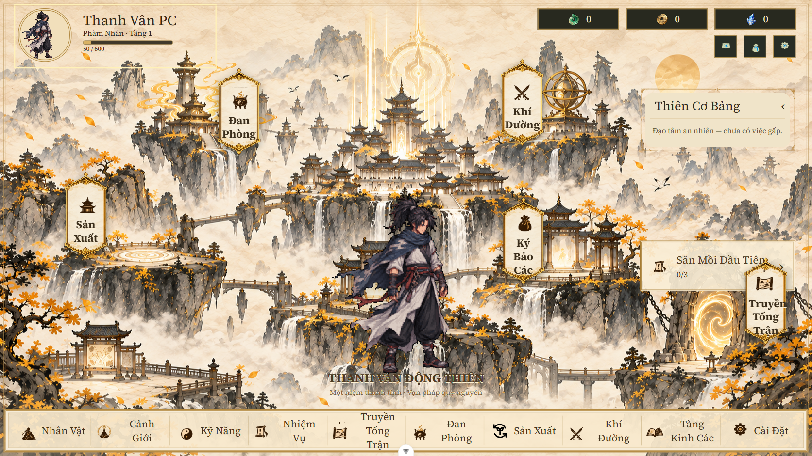
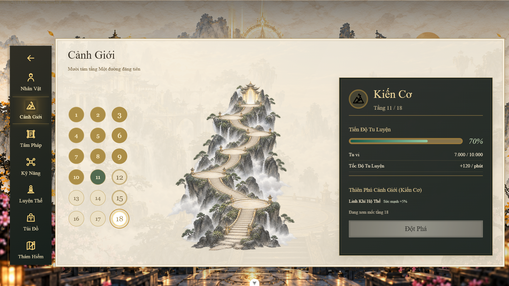
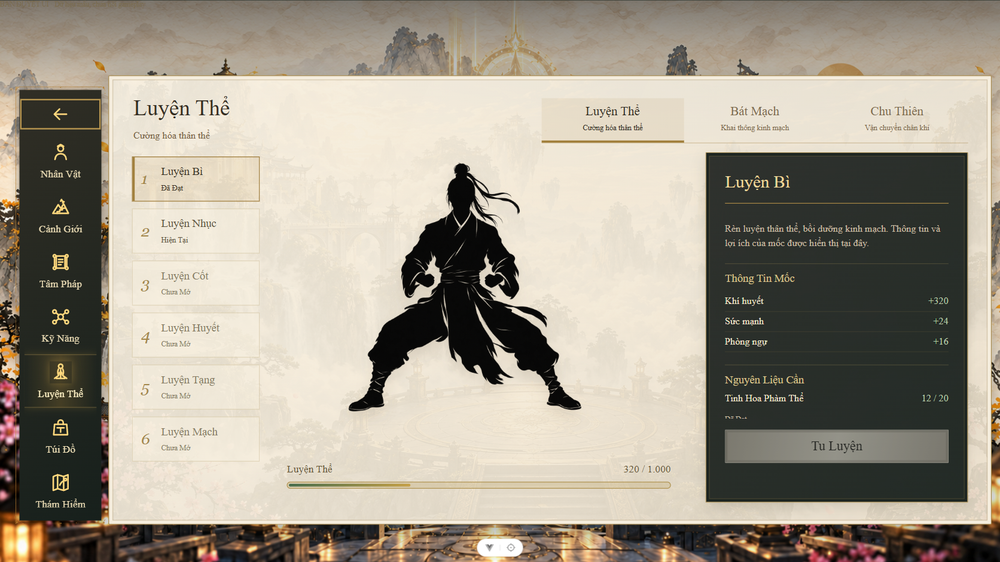
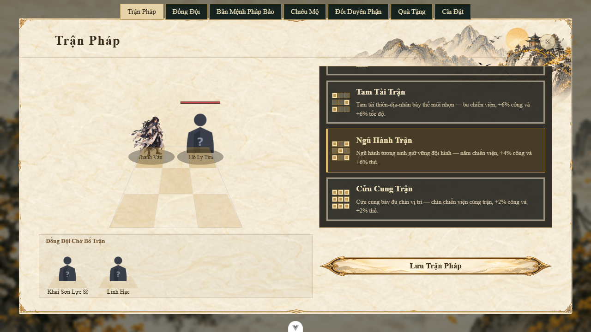

# PC reconstruction: current evidence

> USER VISUAL REJECTION: 2026-10-05, 1/10. Prior functional checks do not establish visual acceptance. The user accepts only the inventory direction and requires matching the approved concept with shared reusable components BEFORE further functional wiring. Production migration is paused; the current work is a pure design-system showcase using one shared paper page, title/tab/button vocabulary and icon family. No completion claim applies to the earlier reconstruction below.

Worktree: `E:/tutienidle/.agent-worktrees/hoa-cau-fireball-vfx`; branch `codex/tien-hiep-ui-redesign`; HEAD `f8af8007b0b6519e6aa6997fedad2cc77939538a`. All UI reconstruction changes are uncommitted. No remote branch reproduces these changes. Runtime server: `http://127.0.0.1:5449/`, started from this worktree.

## Implemented responsibility

Complete PC presentation adaptation to the approved warm ivory paper, ochre watercolor mountains, restrained gold ornament and charcoal inspector concept. Actual production models determine labels, resources, topology, requirements and commands. The generated concept's illustrative functions and values are not gameplay data.

- Opening/auth/creation: initial Begin gate, current ID/auth/resume/new-player flows, existing animated player art; quiet authored landscape with no painted labels or buttons.
- Home: warm mountain panorama, actual building commands, resource counters, quest tracker, bottom navigation; wheel opens through player activation, native Tab traversal preserved.
- Character/equipment/inventory: genuine sockets/stats, current filters/search/pagination, live item inspector, retained model selection and command owners.
- Skills/techniques/realm: real graph topology, grades, costs, passives, eighteen floor markers and breakthrough requirements. No invented distant realm or skill unlock.
- Body: canonical Bì/Nhục/Cốt/Huyết/Tạng/Mạch tiers; current sequential meridians; thirty-six Chu Thiên steps/capacity. Existing figure art preserved.
- Alchemy/exploration/workshop: genuine recipes/stages/costs; actual equipment tabs and selection. Current beta admission remains authoritative for parked tabs.
- Auxiliary surfaces: formations, companion, artifact, production/vendor, recruitment/destiny/gifts, quests/settings, tooltips, confirmation/offline/feedback/lore/system dialogs and combat/tribulation/result presentation.

## Executed checks

- PC Playwright suite: six tests passed in 1.4 minutes on current state. Real quest/settings commands and home navigation, three target viewports (1280x720, 1672x941, 1920x1080), shared dialogs including exterior corner alpha, release-hidden authoring fixtures and populated scene composition. `rebuild-pc-e2e.log`.
- Production combat/victory/defeat and tribulation director flows: separate worker browser evidence in `OUTCOME-WORKER-EVIDENCE.md`. Terminal setup fixtures establish layout/interaction evidence; they do not prove combat outcome resolution.
- Independent auxiliary browser review: six findings repaired and freshly verified; actual production home, creation, tooltip, production cards, vendor empty state, formation drag alignment and all seven auxiliary fixture tabs. `INDEPENDENT-AUX-REVIEW.md`.
- PNG audit: 137 files measured, including alpha at exterior corners and transparent/partial pixel ratios. `ALPHA-REVIEW.json`. Landscape backgrounds and internal paper textures are intentionally opaque; frames/ornaments preserve alpha.
- Type-check and production build completed during full verification. Unbounded full Vitest hit timing failures in two untouched suites; isolated recheck passed 75 tests in 3.01 seconds. A full two-worker rerun is in progress; do not claim full verification from the recheck.

## Resulting-state review chronology

Preliminary review identified contrast failures, formation aspect distortion, the stale Tab wheel shortcut, a superseded backdrop test assertion and stale authoring tools. These were repaired before final aggregate review. Production commands, resource mutation, timing and persistence owners were preserved. Archival generators now refuse execution instead of overwriting current metadata.

Sequential review and aggregate protocol decision are still in progress. This document does not assert QA_FIXED_POINT_REACHED.

## Explicit limits

Phone design is deferred at the user's request. Hidden beta surfaces have authoring-fixture evidence, not proof of production availability. Paid companion feeding, populated vendor transactions, production upgrades and persistence outcome contracts are not established by cosmetic screenshots. Existing missing monster-atlas warnings in the formation preview remain recorded as pre-existing. No external feedback submission, commit, push or merge occurred.

## Current screenshots

