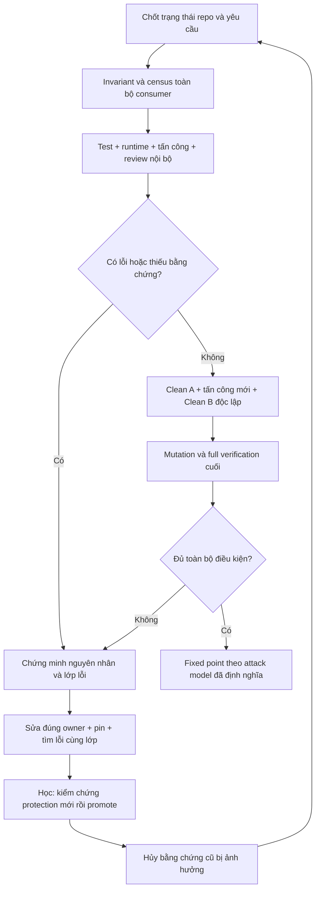

# Thiết kế QA nội bộ thống nhất, có khả năng tự học

Đây là bộ thiết kế và instruction để Devin triển khai, chưa phải QA infrastructure đã được cài hay chứng nhận game không còn lỗi.

**Quyết định chính:** đưa năng lực điều tra/review đang nhờ ChatGPT Web vào workflow của agent chính. Chỉ có một nơi điều phối, một bộ bằng chứng, một vòng sửa–kiểm chứng–tấn công lại và một điều kiện kết luận. Reviewer nội bộ có context riêng hỗ trợ khả năng phản biện; không có external approval bắt buộc.

Ba lựa chọn đã được cân nhắc: gom thành một prompt/checklist đơn lẻ không đủ bảo vệ độc lập và evidence; giữ internal rồi chờ external tiếp tục lệ thuộc đường truyền bất ổn; phương án được chọn là một coordinator nội bộ với nhiều loại bằng chứng và bộ nhớ học hỏi có kiểm chứng.

## Giao cho Devin

Gửi file [DEVIN-PACK.md](DEVIN-PACK.md), chứa đầy đủ instruction và tài liệu; không cần Devin đọc đường dẫn Windows trên máy này. Instruction riêng để xem/copy: [08-devin-instruction.md](08-devin-instruction.md).

Pack là tài liệu triển khai. Khi cài xong, entrypoint của agent chỉ tham chiếu protocol canonical và load phần cần thiết theo scope; không sao chép toàn bộ pack thành nhiều system prompt cạnh tranh.

## Đọc theo thứ tự

| Tài liệu | Nội dung |
|---|---|
| [00 — Audit hiện trạng](00-current-qa-audit.md) | 18 cơ chế hiện có, bằng chứng local/cloud, 15 vấn đề hệ thống và giới hạn của audit |
| [01 — Protocol chính](01-internal-qa-protocol.md) | Authority, aggregate identity, attack operators, closure/invalidation, clean rounds và terminal predicate |
| [02 — Taxonomy](02-taxonomy-and-attack-model.md) | Các lớp lỗi bắt buộc, domain census và attack cards lấy từ lỗi thực tế |
| [03 — Schema](03-ledger-schema.md) | JSON Schema đầy đủ, semantic validation, ledger/message/cycle/lesson contracts |
| [04 — Tự học](04-learning-protocol.md) | Incident -> qualification -> promotion -> áp dụng cho lần sau; chống học sai/nới chuẩn |
| [05 — Instruction cho agent](05-primary-agent-and-reviewer-instructions.md) | Nội dung sẵn để tích hợp vào root rules, agent chính, reviewer nội bộ và message protocol |
| [06 — Benchmark](06-golden-bugs-and-qualification.md) | 20 nhóm lỗi lịch sử làm seed corpus và 32 ca qualification của chính QA system |
| [07 — Kế hoạch áp dụng](07-devin-adoption-plan.md) | Mapping bảo toàn năng lực, file layout, command contracts và 5 nhiệm vụ triển khai |
| [08 — Devin handoff](08-devin-instruction.md) | Yêu cầu triển khai độc lập, phạm vi, rejection criteria và báo cáo bàn giao |
| [09 — Kiểm tra thiết kế](09-design-validation.md) | Những lỗ hổng đã được reviewer nội bộ tìm ra/sửa và các kiểm tra tài liệu đã thực hiện |

## Đối chiếu yêu cầu A–T của prompt gốc

| Deliverable | Nơi đáp ứng |
|---|---|
| A CURRENT_QA_MAP; B CURRENT_SYSTEM_FINDINGS | 00 |
| C DEFECT_TAXONOMY | 02 |
| D INVARIANT_LEDGER_SCHEMA; E FINDING_LEDGER_SCHEMA; F ATTACK_COVERAGE_MATRIX_SCHEMA | 03 |
| G REVIEWER ROLES | 05, 01 section 10 |
| H VERIFICATION GATES | 01 sections 6–7 |
| I DEFECT-CLASS/SIBLING-HUNT; J REGRESSION-PIN | 01 sections 8–9 |
| K PROPERTY/STATE-MACHINE; L TARGETED MUTATION | 01 section 9, 02, 06 |
| M FIXED-POINT ALGORITHM; N NOVEL-ATTACK/CONVERGENCE | 01 sections 11–13 |
| O GOLDEN-BUG BENCHMARK | 06; kết quả đo chưa được chạy, không bịa số liệu |
| P EXISTING-MECHANISM DISPOSITION; Q FILE LAYOUT; S MIGRATION PLAN | 07 |
| R C2C/MULTI-AGENT PROTOCOL | 05 section E: thay C2C bằng message nội bộ theo yêu cầu bổ sung |
| T ACTUAL PROPOSED PROTOCOL/INSTRUCTIONS | 01–05 và 08: nội dung cụ thể để cài, không chỉ outline |
| Bổ sung: tự học sau mỗi lần vấp | 04, schema lessons và qualification QF-22..25/28 |
| Self-review đối kháng | 09 |

## Giới hạn và những điểm phải chứng minh khi cài

Đã đọc source/config/protocol và lịch sử QA, kể cả PR #1/#14/#16 ở SHA ghi trong audit. Chưa chạy game test/browser, chưa replay golden bugs và chưa xác minh capability fresh reviewer trong Devin Cloud. Không gắn nhãn PASS cho các phần đó. Bản thiết kế phân biệt khả năng cơ chế QA đã được qualify với việc game đã đạt fixed point.

Benchmark và preservation mapping là điều kiện chấp nhận để Devin thực hiện; chúng chưa phải số liệu chứng minh năng lực mới. Tài liệu này không sửa AGENTS, skill đang hoạt động, production, dependency hay test infrastructure hiện có.
