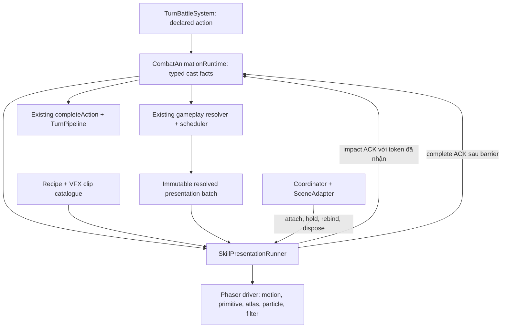

# Hệ thống biểu diễn kỹ năng E2E — Tu Tiên IDLE

Ngày: 2026-09-25. Trạng thái: **DESIGN PROPOSAL — chưa triển khai production**.

## 1. Phạm vi và baseline Git

Thiết kế một cơ chế dùng chung để đi từ hành động combat thực đến hình ảnh, âm thanh, phản hồi trúng đòn và hoàn tất playback. Phi Kiếm là vertical slice đầu tiên; kỹ năng cận chiến, projectile nguyên tố, AoE, buff và combo cùng đi qua contract này. Hỗ trợ effect có sẵn, hình học/particles procedural và kết hợp hai loại. Không yêu cầu vẽ sprite animation mới cho mỗi kỹ năng.

Đã thực hiện `git fetch origin` trước audit. Các SHA được đọc trực tiếp:

| Vai trò | Ref | SHA |
|---|---|---|
| Baseline chính đã chọn trong hội thoại | `origin/devin/1790284398-ngu-kiem-beta` | `af5f6094d83b0d637cf264b215364563fe1bfa4a` |
| Nhánh tích hợp mặc định | `origin/master` | `be1bdf8d5f3fa45cbe82318473980b7b03ec9227` |
| Kiểm tra tương thích Pháp Tu | `origin/devin/1790260800-phap-tu-basic` | `f3a26b3f1405592aad60141feec392a03b235247` |
| Kiểm tra tương thích Kiếm Phổ | `origin/devin/1790269261-kiem-pho-beta` | `794c8ca8d59e3ffc99a3eca93b61d47b8bb3f6c9` |

Ba nhánh feature chưa phải một trạng thái đã tích hợp. Các nội dung chỉ có ở nhánh Pháp Tu/Kiếm Phổ được ghi riêng; không coi chúng đã nằm trên baseline Ngự Kiếm. Trước implementation phải fetch và checkpoint lại các file giao nhau, đặc biệt `CombatAction.ts`, `CombatVfxPresets.ts`, `TurnSkillAction.ts`, adapter và provider. Không tự merge các nhánh đó để làm thiết kế này.

Worktree tài liệu: `E:/tutienidle/.agent-worktrees/skill-presentation-design`, branch `codex/skill-presentation-design`, HEAD bằng baseline chính. Checkout `E:/tutienidle` có thay đổi khác của người dùng, được giữ nguyên. Không commit/push trong công việc thiết kế.

### Task card G0

- Observable outcome: một kỹ năng có bản diễn hoàn chỉnh, thêm kỹ năng cùng kiểu bằng dữ liệu; combat tiếp tục khi thiếu effect, đổi scene hoặc hết tài nguyên render.
- Invariant: domain quyết định toàn bộ kết quả; runtime quyết định thứ tự/timeout; presentation chỉ diễn và báo đến mốc.
- Reuse: `CombatAnimationRuntime`, `TurnPipeline`, `PresentationSession`, `GamePresentationCoordinator`, `PhaserSceneAdapter`, preset registry, geometry/body anchors, asset bundles, animation catalogue, audio binding.
- Missing: typed cast facts, outcome batch hoàn chỉnh, recipe + runner chung, resource scope/pool, contract clip VFX và preview harness.
- Phạm vi tài liệu: audit, contract đích, migration, test và acceptance. Mọi file TypeScript/command triển khai bên dưới là **PROPOSED/PLANNED**, không phải đã có.
- Stop condition của thiết kế: các owner, failure/resume semantics, dữ liệu đầu vào, đường nối production, coverage và giới hạn đều cụ thể; không thay đổi production/save.

## 2. Hiện trạng được xác minh

Các đường dẫn trong tài liệu tính từ repository root. SOURCE = đọc source tại SHA trên; INFERRED = hệ quả cần test để xác nhận runtime; PLANNED = công việc sẽ phải làm.

| SOURCE | Hiện trạng và ý nghĩa |
|---|---|
| `game/src/core/game/GameManagerTurnBattleOps.ts:beginTurnPipeline/awaitStep` | Pipeline chờ `ready`, `impact`, `complete`; fallback hiện là **4.000 ms mỗi step**. Headless gọi cùng mechanical methods. Không thêm clock combat khác. |
| `game/src/core/battle/turn/CombatAnimationRuntime.ts` | Giữ pending declaration/impact, validate token, gọi `applyActionImpact`, rồi `completeAction`. Resume đổi token. |
| `game/src/core/battle/turn/TurnSkillPlanRuntime.ts:routeCast/buildHooks` | Production dùng `LegacySkillAdapter → SkillResolver → SkillExecutor → scheduler`. Hook đã thấy operation và kết quả settled. Legacy hit loop còn phục vụ cấu hình unit không có runtime. |
| `game/src/core/battle/turn/TurnActionPresentationEvents.ts` | Cast event chỉ mang source, target đầu tiên, skill ID. Không có identity playback trong event, resolved preset, số instance hoặc cast disposition. |
| `game/src/game/scenes/combat/combat-action-feedback.ts` | Mọi cast dùng lunge; đọc token hiện tại lúc nhận event. Mỗi `action_impact` tự gắn callback ACK complete. |
| `game/src/data/vfx/CombatVfxPresets.ts` + `game/src/game/support/ActionImpactVfx.ts` | Registry chung đã có; renderer chỉ diễn ground polygon/rings và upright ring/core, tối đa hai Graphics/một tween. `attached` và `screen` hiện rơi vào ground fallback, chưa có diễn xuất đúng nghĩa riêng. |
| `game/src/core/battle/turn/CombatAnimationRuntime.ts:acknowledgeActionImpact` | Primary `hitCount` đang là 1; có thể emit thêm nhiều impact của combo. Preset lấy từ root action, chưa luôn phản ánh empowered/composite payload. `affectedArea` dựng một ô dù targeting có thể rộng. |
| `game/src/core/combat/CombatEvent.ts` + `CombatScene.ts:getCombatEventBindings` | Damage/hit/crit/death là luồng độc lập phát khi domain resolve. `hpDamage` mới là HP thực mất; `value` là giá trị trước hấp thụ. |
| `game/src/presentation/audio/combatAudioBinding.ts` | Audio có owner riêng và đang nghe attack/hit/crit/dodge/block/death. Không để recipe phát lại toàn bộ các âm thanh này. |
| `game/src/presentation/gate/PresentationGate.ts` | Command port đóng: ba ACK, token query, presentation-active. Snapshot/resume ở port riêng. Không mở quyền chọn target/damage từ renderer. |
| `game/src/presentation/assets/AssetBundleCatalog.ts` | Đã có catalogue/bundle loader chung. VFX phải dùng owner này khi cần nạp atlas. |
| `game/public/assets/vfx/README.md` và inventory thực | **568 PNG + 569 JSON, tổng 210.562.869 bytes**. Thư viện đã import; tìm trong `game/src`/`game/scripts` chưa thấy reference tới đường dẫn spritesheets này. |
| `game/package.json` + `game/package-lock.json` | Phaser khai báo `^4.2.1`, lock tại **4.2.1**. Không dùng hướng dẫn renderer/preFX/postFX của Phaser 3 như thể còn nguyên API. |

**Sửa nhận định audit ban đầu:** repo có thư viện VFX rất lớn. Chưa xác minh có clip hoàn chỉnh đúng Phi Kiếm, nhưng không thể kết luận repo thiếu asset VFX.

Các khoảng trống quan trọng:

1. **INFERRED:** primary và combo cùng giữ một playback token; effect ngắn nhất có thể ACK complete trước effect dài hơn. Token chống callback stale không thay cho completion barrier của một action. Cần regression trên production composition.
2. `hitCount`/target lists hiện tại không mô tả được từng kiếm hit/miss/skip. Số kiếm dự kiến không đồng nghĩa số hit thực thi.
3. Không được suy ra “né” bằng `affected - landed`: cast có thể bị chặn, target chết, apply buff, hoặc bị intercept.
4. Runtime resolve toàn bộ action trong một lần impact ACK, gồm nhiều operation theo thứ tự. Animation của từng kiếm không phải mỗi lần mutation HP riêng.
5. `ActionImpactVfxHandle.complete()` có cleanup idempotent nhưng không có contract cancel tween độc lập. Pool/runner mới phải có cancel rõ ràng.
6. `preparePresentationResume` không có đầy đủ cast descriptor/outcome để dựng lại bản diễn; nhánh complete hiện ACK sau 50 ms.

Kiểm tra các nhánh song song:

- Pháp Tu mới thêm `hoa_cau_comet`, `thuy_tien_dart`, `doc_chuong_palm`, `diem_kim_point`, `tho_cau_boulder` và các preset phàm nhân; hiện vẫn là cấu hình generic.
- Kiếm Phổ thêm `signature: VfxStroke[]`, ví dụ Đâm `point → line → converge`, Chém `crescent → arc → scar`, sáu combo beta có signature. File tự ghi **DATA ONLY**. Hệ thống đề xuất phải thực sự tiêu thụ những token này sau tích hợp, tránh tạo bảng mô tả trùng.

## 3. Quyết định kiến trúc

| Phương án | Đánh đổi | Quyết định |
|---|---|---|
| Recipe dữ liệu + runner chung + primitive render | Thêm contract một lần; reuse asset/procedural và kiểm thử headless được | **Chọn** |
| Mỗi skill một controller | Nhanh cho một effect, nhưng phân tán ACK, resource và lifecycle | Không chọn làm kiến trúc chung |
| Visual scripting graph/editor tổng quát | Công cụ author mạnh, nhưng tạo thêm compiler/editor lớn khi chưa có nhu cầu chứng minh | Ngoài scope |

Một recipe ghép các primitive hữu hạn; không chạy script tùy ý và không gọi domain. `CombatAnimationRuntime` tiếp tục giữ state machine combat playback. Runner mới chỉ giữ state hiển thị của một request, không thay `TurnPipeline` hay coordinator.



### Owners và dependency direction

| Trách nhiệm | Owner |
|---|---|
| Target, instance count, hit/miss/crit, damage, ward, buff, death, RNG | Các domain owner hiện tại; collector chỉ copy kết quả |
| Pending action, token, impact/complete, headless và fallback | `CombatAnimationRuntime` + `GameManagerTurnBattleOps` hiện tại |
| Request facts/outcome projection | `TurnSkillPlanRuntime`/`TurnBattleSystem` cung cấp facts; runtime đóng batch |
| Recipe và visual identity theo preset | `game/src/data/vfx/SkillPresentationRecipes.ts` đề xuất |
| Compile recipe, visual phase, dedupe, completion barrier | `SkillPresentationRunner`, không import Phaser |
| Graphics/Sprite/particles/filter/lease | `PhaserSkillPresentationDriver`, scene-scoped |
| Geometry, entity animations, text, âm thanh, persistent status | Tái sử dụng các owner hiện có qua port hẹp |
| Nạp texture ngoài, route readiness, game lifetime | AssetBundleManager, coordinator, SceneAdapter hiện có |

Core có thể giữ ID presentation và facts thuần dữ liệu, không import recipe/Phaser/asset URL. Data recipe được presentation đọc. Driver không nhận `PlayerData`, damage authority hoặc mutable combat entity.

## 4. Contract đầu vào: intent khác outcome

Thêm `SkillPresentationFacts.ts` tại `game/src/core/battle/turn/`. Các kiểu dưới đây mô tả contract đích; branded domain IDs hiện có được giữ ở implementation.

```ts
type PlaybackRef = Readonly<{
  sessionId: number
  requestId: string
  token: string
}>

type ActorAnchorFact = Readonly<{
  entityId: string
  row: number
  column: number
}>

type CastDisposition =
  | 'action' | 'charge-start' | 'charge-tick' | 'charge-release'
  | 'blocked' | 'empty'

type SkillCastPresentation = Readonly<{
  ref: PlaybackRef
  rootSkillId: string
  resolvedSkillId: string
  presetId: CombatVfxPresetId
  source: ActorAnchorFact
  declaredTargets: readonly ActorAnchorFact[]
  candidateInstanceCount: number
  disposition: CastDisposition
}>

type SkillPresentationResolved = Readonly<{
  ref: PlaybackRef
  groups: readonly ResolvedPresentationGroup[]
  sealed: true
}>
```

`ResolvedPresentationGroup` bắt buộc gồm `groupId`, `role` (`primary`, `composite`, `combo`), resolved skill/preset ID nếu có, source anchor, actual target anchors, footprint và ordered outcomes. Primary luôn có group, kể cả empty/blocked. Mỗi outcome có ID ổn định; khi có operation thì giữ `operationId`, `castId`, `rootActionId`, `subcastIndex` từ domain. Outcome là tagged union:

- `hit`: target, hit ordinal trong group, landed, crit, HP damage, killed. Ward/mana-shield breakdown chỉ đưa khi authority cung cấp, không tính lại từ HP chênh lệch.
- `heal`: target và lượng heal thực từ `HealResult`.
- `status`: target, buff instance ID và result apply/remove thực.
- `skipped`: reason do execution owner phát; không giả làm dodge.
- `no-effect`: blocked/charging/empty/unsupported với reason cụ thể.

Footprint là union `cells` (danh sách ô authoritative), `entity-targets` (buff/self), hoặc `none`; không dùng bounding rectangle để biến target rời rạc thành vùng damage. Thêm projected region đẹp hơn không được mô tả là vùng gây damage khi domain chỉ có target set.

### Tạo facts ở đâu

1. Sau declare, builder thuần dữ liệu đọc `execution.resolvedSkill`, `chargedSkill` hoặc basic fallback theo disposition; không gọi provider/SkillResolver lần hai. Snapshot detached, không giữ `TurnDeclaredAction` hay closure `perInstanceOptions`.
2. `candidateInstanceCount` từ def đã resolve. Đây là số blade được chuẩn bị; không phải cam kết mọi blade sẽ đánh được.
3. Production collector ghép thêm dữ liệu vào session sẵn có của `TurnSkillPlanRuntime`; `onOperationSettled(operation, result, plan)` là nguồn chính. Không chỉnh thứ tự hook, không thêm RNG hay `mintOccurrence()` chỉ để tạo ID visual.
4. Giữ đủ group/provenance ở `routeCast` và `routeExtraCast`. Composite extras bên trong executor khác với provider combo extras; cả hai phải xuất hiện đúng group, không flatten mất identity.
5. V1 không đưa reaction/DoT vào nhóm visual bắt buộc của action. Chúng tiếp tục dùng feed quan sát hiện có, no-ACK, tránh diễn hai lần cùng hậu quả. Collector chỉ nhận operation thuộc các cast primary/composite/combo của request; không nhận toàn bộ hậu quả scheduler theo khoảng thời gian. Nếu cần đối chiếu provenance cho diagnostic/test, dùng `CombatTrace` và causation; không sort riêng theo `combatSequence` để suy cây nhân quả, không scan journal mỗi frame. Mở rộng choreography reaction sau này phải chuyển ownership visual rõ ràng trước khi thêm group role.
6. `TurnBattleSystem.applyActionImpact` trả thêm detached presentation receipt bên cạnh bookkeeping hiện tại. Runtime phát **một batch đã sealed** sau khi tất cả inline groups đã có. Queued repeat/multicast/counter vẫn là lần execution sau do pipeline hiện tại điều khiển, không giả thành extra của lần trước.
7. Engine-unit lane không scheduler cần adapter receipt từ chính hit result của nó. Test lane này không thay thế production-factory parity test.

`requestId` là identity presentation do runtime cấp tại declare và giữ xuyên resume; không giả bằng domain `rootActionId` vì ID operation hiện được mint muộn trong `routeCast`. Group ID = request + ordinal được cấp khi xây receipt. Token đổi khi reattach; request vẫn chỉ một action. Reset battle xóa pending request; không serialize vào save.

## 5. Lifecycle, ACK và completion barrier

```text
cast facts → release/travel → waiting-result → impact groups → recovery → completed
                         impact ACK ↑                         complete ACK ↑
                           một lần                               một lần
```

Ready flourish là bước runtime hiện có trước cast. Bản diễn của skill không lặp lại ready; manual wait không tự khai triển action trước lựa chọn người chơi.

- Cast event mang token; runner giữ command port và attachment epoch lúc nhận, không đọc token mới khi tween cũ hoàn tất. Scene đối chiếu session; command port giữ validate token hiện có. Không cần mở thêm lệnh gameplay trong `DomainCommandPort`.
- EventBus dispatch đồng bộ. Runner ghi state `waiting-result` trước impact ACK, nhận result bằng inbox, rồi drain an toàn sau khi call stack ACK kết thúc. Không phát completion ACK ngay bên trong callback `emit`, nhất là zero-duration/missing asset. Đây là regression bắt buộc với pipeline thật.
- Mỗi request có barrier cho **toàn bộ nhóm impact bắt buộc và recovery**. Chỉ runner có quyền complete. Sprite animation, particle và tween không giữ command port.
- Batch đã sealed nên không có race “primary đã xong rồi extra mới được đăng ký”. SFX, camera impulse, afterglow và aura dài hạn không tham gia barrier.
- Duplicate request/batch/group không replay. Runtime reject stale token; runner còn reject sai session/attachment. Dedupe set được prune theo request/session, không tăng mãi.
- Primitive lỗi/asset thiếu/pool đầy: trả skipped visual handle và giải phóng lease; runner dùng fallback ngắn, vẫn báo mốc. Gameplay failure khác visual failure: không biến domain exception thành success.
- Scene mất renderer: dùng lifecycle hiện có. `hold` hủy resource local và giữ pending domain; chỉ chuyển sang headless khi policy hiện có yêu cầu. Không dùng `setPresentationActive(false)` như một cách chữa lỗi render.
- Watchdog 4.000 ms hiện ở runtime tiếp tục là đường an toàn. Recipe validation yêu cầu cast phase và phần resolved phase mỗi phần tối đa 1.500 ms; lỗi nội dung bị báo lúc load. Runner không dựng watchdog thứ hai và không tự quyết định advance turn.
- `turn_standby_complete` hoặc token không còn pending thì runner đóng request, kể cả khi runtime fallback đến trước visual completion.

### Resume, cancel và pause

| Tình huống | Hành vi đích |
|---|---|
| Resume ở ready | Ready flourish hiện có với token mới |
| Resume ở cast | Runtime trả descriptor detached cùng request ID/token mới; dựng lại cast từ đầu, chưa resolve lại damage |
| Resume sau impact | Runtime giữ sealed batch trong pending impact; phát đoạn recovery ngắn tối đa 120 ms rồi complete; không phát lại damage number/hit sound/death |
| Rebind/auto-refight/shutdown | Cancel scope, stop update/listener, trả pool; cancel không ACK. Runtime/coordinator xử lý pending theo policy của nó |
| Game replacement | Driver bị destroy theo game generation; closure cũ giữ port cũ, không tra registry mới để ACK |
| Pause/hold/background | Dùng trạng thái session và policy fallback hiện hành; không dùng `scene.pause()` để tạo hit-stop |
| Resize giữa chuyến bay | Reproject anchor facts tại progress hiện tại; không reset timeline, không đổi target hoặc ACK count |
| Source/target biến mất | Dùng immutable last-known anchor cho đoạn còn lại; bỏ flash lên sprite không tồn tại, không hồi sinh sprite |

Hold kéo dài qua watchdog 4 giây là **first-proof obligation**: test bằng production pipeline trước migration. Nếu pending step bị settle trong khi domain ACK đang bị session block, sửa coherence ngay owner runtime trong phạm vi này; không xử lý bằng timer trong Phaser. Tài liệu không khẳng định trường hợp này đã chạy đúng.

## 6. Recipe, primitives và điểm mở rộng

`SkillPresentationRecipe` có `id`, `version`, `cast`, `impact`, `recovery`, `visualStyle`, `quality`, `fallback`. Registry key theo preset; authored preset là presentation identity. Default recipe áp dụng cho preset chưa có choreography riêng.

Mỗi phase là tập cue song song với `offsetMs`, `durationMs`, primitive ID, anchor, vật liệu, scale theo body/cell, và điều kiện outcome. Commit marker duy nhất nằm ở cuối cast. Loop vô hạn, callback tùy ý, nhánh đọc player state và tùy chọn gọi damage không hợp lệ. Compiler kiểm tra duration hữu hạn, reference có thật, anchor hợp lệ, giới hạn tài nguyên; không cần graph language tổng quát.

| Primitive | Input và behavior |
|---|---|
| `actor-impulse` | Offset/pose qua animation owner; không mutate trực tiếp scale do projection đang ghi mỗi frame |
| `trajectory` | source/target anchor, đường thẳng hoặc Bézier, progress easing, tangent rotation, optional return path |
| `stroke` | point/line/crescent/arc/scar/ring/wave/converge; shape + envelope; dùng cùng vocabulary `VfxStroke` của nhánh Kiếm Phổ khi tích hợp |
| `trail` | Ring buffer điểm có giới hạn, độ dày/alpha theo tuổi; không tích lũy path vô hạn |
| `afterimage` | Snapshot transform visual, lifetime ngắn, pool giới hạn |
| `burst` | Spark/dust/energy bằng particles hoặc Graphics; không physics collision |
| `atlas-clip` | Clip ID đã kiểm định, frame range/FPS/origin/blend; không nhận URL tùy ý |
| `ground-shape` | Footprint thật qua `BattleGridProjection`; decorative ring có scale độc lập |
| `filter-envelope` | Glow/blur hoặc filter hỗ trợ trên Phaser 4; có path bỏ filter khi backend không hỗ trợ |
| `camera-cue`, `audio-cue` | Cường độ/âm lượng nhỏ, finite, cosmetic; không giữ combat barrier |

API chung của render handle: `sample(progress)`, `finish()`, `cancel()`. `finish`/`cancel` đều idempotent và dừng mọi resource liên quan; chỉ runner quyết định cue đã xong có làm barrier hoàn tất hay không. Driver có `tick(deltaMs)`, `reset(reason)`, `destroy()`; renderer không tự tạo RAF loop song song với scene.

Persistent aura/shield/status không kéo dài lifetime một cast. Chúng được gắn bằng `statusInstanceId` qua status attach/update/remove + snapshot reconciliation hiện có. Charge nhiều turn cũng là state do domain cung cấp; một recipe không ngủ N turn chờ tự gây damage.

## 7. Dùng hiệu ứng sẵn có và chất lượng hình ảnh

**Quyết định:** procedural-first cho chuyển động/hình học; thư viện clip có sẵn cho chi tiết khi phù hợp; texture mới chỉ là lựa chọn art về sau. Không có điều kiện bắt buộc phải vẽ mới để effect hoạt động.

Phaser 4 có Filters dùng được với nhiều loại game object; tài liệu chính thức mô tả kiến trúc thay thế preFX/postFX cũ. Particles vẫn cần hình nguồn để vẽ từng hạt, nhưng hình đó có thể là texture nhỏ sinh một lần bằng code. “Không vẽ sprite thủ công” khác với “GPU không dùng texture”. Tham chiếu: [Filters Phaser 4](https://phaser.io/news/2026/05/phaser-4-filter-system), [renderer Phaser 4](https://phaser.io/tutorials/phaser-4-rendering-concepts), [particles](https://docs.phaser.io/phaser/concepts/gameobjects/particles).

| Nguồn hình ảnh | Phù hợp | Giới hạn |
|---|---|---|
| Hình học + particle + filter | Phi kiếm, vệt chém, tia, pháp trận, kiếm khí, aura | Cần silhouette, nhịp và palette tốt; glow tự nó không tạo hình đẹp |
| Atlas có sẵn | Impact, smoke, magical burst, flame có chuyển động chi tiết | Có thể lệch art direction, crop/pivot sai hoặc màu baked khó tint |
| Asset mới riêng | Long ảnh, linh thú, thư pháp và hình phức tạp đặc trưng | Thêm công tạo asset; không cần cho slice đầu |

Đã xem tĩnh hai atlas mẫu, không phải đã duyệt playback:

- `2D Cartoon FX (Field Lines) #1`: 32 frame, ô 200×150, atlas 1600×600; nét trắng hướng tâm phù hợp thử làm impact spark.
- `Slash_10`: 16 frame, ô 200×150, atlas 1600×300; màu xanh lá bão hòa, chưa phù hợp palette Phi Kiếm mặc định. Tint nhân màu không biến mọi màu baked thành trắng tùy ý; chọn clip trung tính hoặc filter đã kiểm chứng.
- `2D Cartoon FX (Slashes) #18`: metadata 32 frame đã đọc; hình/chuyển động chưa xem, chưa chọn để ship.

Chất lượng không tự giảm vì thiếu sprite vẽ tay. Các tiêu chí art là silhouette đọc được, timing có tăng tốc, trail sắc, glow không cháy trắng, trúng/né khác nhau và tầng lớp hợp background. Với hình organic phức tạp, asset có chủ đích thường giúp tăng độ tinh tế. Chưa có runtime proof nên không hứa mức đẹp cuối cùng chỉ từ source hay atlas tĩnh.

### Catalogue và loading

Thêm `VfxClipCatalogue.ts` mô tả key, PNG/JSON, frame keys theo thứ tự số, FPS, pivot, visible extent, native direction, blend mode, loop policy và fallback primitive. Kiểm tra pairing: 569 JSON/568 PNG nghĩa là không được giả định mỗi JSON đều có PNG tương ứng. Đọc metadata và decode file được chọn, không đoán từ tên.

Không nạp 568 sheet lúc vào combat. `AssetBundleCatalog` đăng ký danh sách nhỏ các clip đã admit trong release; `AssetBundleManager` nạp qua loader hiện có. Slice đầu procedural là guaranteed path; clip optional lỗi thì dùng procedural và ghi diagnostic một lần. Không tải HTTP tại impact và không chặn action chờ atlas.

Texture sinh bằng code có key/version và owner theo Phaser Game lifetime; tạo một lần, recreate khi Game thay mới. Scene pool chỉ mượn, không gọi remove texture của bundle manager. Ghi nguồn và trạng thái quyền sử dụng clip trong catalogue khi admit; README hiện chỉ xác nhận nguồn import, không tự chứng minh license distribution.

## 8. Phi Kiếm: ca kiểm chứng đầu tiên

Recipe đề xuất `ngu_kiem_flight`: kiếm trắng-bạc, ánh thanh lam mảnh và điểm vàng nhạt. Shape procedural, trail/afterimage bằng code; spark có thể chọn clip trung tính đã kiểm định. Giữ khả năng chạy hoàn toàn procedural.

| Phase | Thời gian đề xuất | Hình ảnh / mốc |
|---|---:|---|
| Release | 120 ms | Kiếm lơ lửng cạnh vai/back anchor, glow chạy dọc lưỡi, kéo nhẹ ngược hướng lao |
| Cruise | 180 ms | Bézier cong nhẹ, rotation theo đạo hàm, trail mảnh |
| Acceleration | 70 ms | Tăng tốc ở cuối đường, trail kéo dài, 1–2 afterimage |
| Commit gate | tại 370 ms | Runner báo impact đúng một lần, domain resolve cả action |
| Penetration/impact | 80 ms | Actual target/outcome từ receipt; white slash và spark nhỏ, whiff rõ nếu né |
| Impact hold | 25 ms trong 80 ms trên | Giữ peak visual local; không pause game/scene/clock |
| Recall | 170 ms | Fade sau target rồi trở về qua đường cong khác; tail tan trước completion |

Tổng bản diễn cơ bản khoảng 620 ms, ngoài ready flourish hiện có. Con số là tuning proposal, cần canvas playback; không đổi cooldown/chargeTurns/combat tick.

Tangent tính từ đạo hàm đường Bézier; derivative gần zero dùng tangent hữu hạn trước đó hoặc vector source→target. Facing trái/phải do vector anchor, không hard-code `sourceId === player`. Độ cong/kiếm scale theo body/cell và viewport, không theo kích thước atlas trắng ngoài silhouette.

Với N kiếm: chuẩn bị tối đa visual budget; tất cả đến vùng commit cùng một nhịp. Receipt quyết định kiếm nào thật sự hit/miss/không được thực thi. Remaining blade không được tạo fake hit nếu target/caster chết sớm. Các nét impact có thể lệch nhẹ trong tối đa 90 ms cho dễ đọc; damage numbers và HP vẫn đến từ domain tại commit. Đây là trình bày kết quả atomic, **không phải mỗi animation kiếm chạy xong mới trừ HP**.

Intercept có thể đổi target ngay trong `applyActionImpact`. Outbound chỉ đến vùng tiếp cận của intended target; penetration/flash chuyển theo actual target trong receipt. Không cho projectile collision hay renderer tự quyết định người đỡ đòn. Dùng đường nối ngắn ở impact nếu hai anchor lệch, test protector đứng khác hàng.

Recall là visual tail: source chết thì tan tại chỗ/last-known anchor, không đòi entity còn sống. Camera cue đề xuất 40 ms, intensity 0,001–0,0015, tối đa một lần/action khi có landed hit; reduced motion tắt. Hit flash dùng owner hiện có, không cộng thêm một full-screen white flash.

## 9. Đồng bộ feedback và các loại skill khác

V1 giữ domain events `attack/hit/damage/critical/death/heal` phát và được quan sát tại thời điểm commit như hiện nay. Recipe sở hữu đường bay, slash và recovery; feedback owner hiện có sở hữu hit recoil/number/death và audio hit. Không emit lại domain event để replay hình ảnh; không tạo cache HP thứ hai.

Impact groups của primary/composite/combo cùng lấy mốc commit; có thể giữ effect lâu hơn, nhưng không dựng một đoạn “gây damage sau 2 giây” khi HP đã giảm ngay. Toàn bộ group semantic nằm trong completion barrier. SFX riêng của recipe chỉ là release/whoosh/recall không trùng `COMBAT_EVENT_SOUNDS`; nếu sau này migrate hit audio thì phải chuyển ownership một lần, không cho cả hai cùng phát.

| Kiểu skill | Cách biểu diễn qua cùng cơ chế |
|---|---|
| Cận chiến/Đâm/Chém | actor impulse + signature stroke; không cần clip nhân vật cast/punch mới |
| Hỏa cầu/Thủy tiễn | trajectory một chiều + material nguyên tố + impact; không recall |
| AoE | charge cue + ground footprint domain + một primary burst; target flash giới hạn |
| Buff/self/heal | source/recipient aura hoặc ring; đọc receipt application/heal, không fake damage impact |
| Kiếm Phổ combo | sealed extra group giữ preset/signature riêng, barrier chờ cả primary và combo |
| Empowered/composite | chọn preset từ payload đã resolve; không roll pool hay đọc Thế lần nữa |
| Repeat/multicast/counter | request execution riêng theo runtime; không dùng particle count thay số cast |
| Charge/CC/no target | disposition `charge-*`/`blocked`/`empty`; không diễn hit không tồn tại |
| Reaction/DoT/persistent | feed quan sát hiện có, no-ACK; không sinh thêm lượt hay reset duration gameplay |

Mục tiêu “dùng chung” chỉ được chấp nhận khi ít nhất Phi Kiếm, một basic cận chiến, một AoE và một buff/heal chạy qua runner bằng dữ liệu. Preset khác có fallback generic hợp lệ; không tuyên bố mọi skill đã có art riêng.

Diễn từng hit với HP/death delay riêng theo từng frame là extension lớn hơn: cần correlated feedback stream và visual-state reconciliation. Không lén đưa vào slice đầu; nếu muốn từng hit thật sự resolve ở các thời điểm khác nhau thì cần sửa execution scheduling do domain sở hữu và chứng minh parity riêng.

## 10. Resource, chất lượng và geometry

Pool theo scene, texture theo Game. Mỗi request có `VfxLeaseScope` sở hữu acquired objects, tween/listener/particle/filter handle. Release reset visibility, transform, alpha, blend, tint, depth, emitter state, callback và filter; cancel tween trước khi clear/destroy Graphics. Cấm pending callbacks dùng lại object đã trả pool.

Ngân sách khởi đầu, **chưa phải benchmark**:

| Resource trong một scene | Standard | Low/reduced motion |
|---|---:|---:|
| Blade/projectile visible | 8 | 3 |
| Trail sample / blade | 24 | 8 |
| Afterimage đồng thời | 24 | 0 |
| Transient particle sống | 256 | 48 |
| Graphics lease | 24 | 12 |
| Image/Sprite lease | 32 | 16 |
| Emitter lease | 4 | 2 |
| Filter region hoạt động | 2, local bounds | 0 |

Pool exhaustion giảm glow → particles → afterimage → mật độ blade; giữ primary silhouette và semantic cue. Nếu số instance vượt cap, thể hiện một bó kiếm dày hơn và diagnostic `visualCount/candidateCount`; không báo rằng chỉ còn cap hit gameplay. Giảm số draw object không được bỏ outcome thực hay ACK. Quality/reduced motion giữ nguyên mốc commit/completion ở cùng playback speed để cài đặt đồ họa không âm thầm đổi cadence auto-combat.

Camera shake không áp ở reduced motion. Không dùng global game timeScale hay pause scene cho hit-stop. Hình dạng và vị trí cũng phân biệt hit/whiff/buff, không dựa chỉ vào màu. VFX nằm dưới damage text/HUD theo `BattleLayers`; upright depth theo projected foot, ground cue qua projection hiện có. Resize giữ progress và reproject logical anchors; stored screen position chỉ là last resort khi entity mất.

VFX noise lấy từ local seed `hash(requestId, groupId, recipeVersion)`, không gọi CombatRng và không reseed RNG toàn cục của Phaser. Nếu particle API không hỗ trợ nguồn random riêng phù hợp, dùng sample precomputed do driver sinh. Chế độ preview deterministic cần cả particle seed.

Đo trên browser thực sau warmup 20 cast, ít nhất 100 cast hoặc 5 phút refight; lưu viewport, DPR, renderer, GPU/máy, tier. So sánh frame-time p95 và resource counts trước/sau; không dùng timing CI làm phép đo GPU. Acceptance tài nguyên: không vượt cap, active lease về 0 khi hết effect, listener count không tăng sau 20 rebind/100 repeat. Mục tiêu ban đầu phần update VFX p95 ≤2 ms trên máy kiểm chứng được ghi rõ; đây là mục tiêu phải đo, không lời hứa trên mọi thiết bị.

## 11. Preview và E2E production

Đề xuất trang dev-only `game/dev/skill-vfx.html`, mở bằng Vite tại `/dev/skill-vfx.html?preset=ngu_kiem_flight`; module entry kiểm tra `import.meta.env.DEV` trước khi mount. Không đăng ký một route gameplay/scene manager thứ hai. Trang preview tạo Game riêng biệt với **cùng** runner/driver/catalogue và fake ACK port chỉ ghi trace. Không import save store hoặc ghi localStorage gameplay. Production build không có link/entry hoạt động tới công cụ này.

Preview có preset picker, replay, pause/step, speed 0,25/1/2, quality/reduced motion, seed, hit/dodge/intercept/source-death cases, source/target anchors, counter lease và phase marker. Nút/label qua i18n và component chung. Scrub chỉ dùng recorded immutable fixture; không rewind GameManager. Fixtures lấy từ test production factory và ghi rõ SHA, không tự tạo damage để giả parity.

Preview để chỉnh art, không chứng minh game wiring. E2E thứ hai bắt buộc đi game thật: guest mới/test save tách biệt → seed đúng prerequisite Trảm Lv3 → Quán Khí → chọn **Vạn Kiếm Quyết** → stage → `ngu_kiem_thuat` thật → cast/impact/recall → lượt kế/refight/exit. Tái dùng helpers từ `cultivation-path-ritual.spec.ts` và `combat-vertical-slice.spec.ts`; không chỉnh save của người dùng.

Evidence browser gồm clip hoặc screenshot tại release/cruise/impact/recall, console errors, phase trace chỉ đọc, HP/outcome assertions, và battle progression. Trace không thay kiểm tra pixel. Thử viewport desktop lẫn hẹp, flat/perspective, missing texture, reduced motion và re-entry. Các command/file này là đường sẽ xây khi implementation, chưa chạy được từ tài liệu.

## 12. Migration theo dependency

Mọi gate dưới đây **PLANNED**, chưa PASS. Không cần test/build production cho thay đổi Markdown hiện tại.

| Slice | Thay đổi và file chính | Bằng chứng bắt buộc trước slice kế |
|---|---|---|
| S0 — characterization | Tests tại runtime/pipeline/production factory; xác nhận nested events, hold/timeout, extras, intercept, root/payload và multi-instance | Cùng seed/command sequence: trace gameplay và RNG draw count giống interactive/headless; reproduce completion race nếu tồn tại |
| S1 — facts/receipt | Thêm `core/battle/turn/SkillPresentationFacts.ts`; sửa `TurnSkillPlanRuntime.ts`, `TurnBattleSystem.ts`, `TurnActionPresentationEvents.ts`, `CombatAnimationRuntime.ts`; snapshot/resume đúng | Main/composite/combo groups, skipped/blocked, death mid-instance, immutable payload; không gọi resolver hai lần |
| S2 — shared runner + generic migration | Thêm `presentation/skills/SkillPresentationRecipe.ts`, `SkillPresentationRunner.ts`, `data/vfx/SkillPresentationRecipes.ts`; adapter generic impact | Đúng một impact và complete/request; sealed barrier; stale/duplicate/reentrant/no-effect; production generic không đổi outcome |
| S3 — Phaser resources + Phi Kiếm | Thêm `game/support/skill-vfx/PhaserSkillPresentationDriver.ts`, `VfxLeaseScope.ts`, `VfxPool.ts`, `trajectory.ts`, `strokes.ts`; nối `CombatScene.ts`, `combat-action-feedback.ts`, `combat-vfx-spawner.ts`; cập nhật `NguKiemDaoSkills.ts`/preset | Actual Ngự Kiếm E2E + visual sequence; target left/right/intercept, zero leaks, no scene pause |
| S4 — shared content + asset admission | `VfxClipCatalogue.ts`, bundle catalogue, recipes melee/AoE/buff; consume branch signatures sau integration được cho phép | Ít nhất bốn loại thật qua chung runner; missing atlas fallback; không preload toàn thư viện |
| S5 — preview + acceptance | `dev/skill-vfx.html`, dev preview module, `tests/e2e/skill-presentation.spec.ts`, `ngu-kiem-vfx.spec.ts`, lifecycle/resource checks | Preview đẹp và production chạy; full verify, runtime evidence, QA theo repo |

S2 chuyển ownership ACK cho **mọi action** ở cùng integration step: `CombatScene` dùng batch handler; `CombatActionFeedback` không còn ACK complete riêng trên mỗi `action_impact`. `CombatVfxSpawner` giữ role primitive/status/spawn, không tiếp tục phát duplicate primary VFX. Legacy `action_impact` có thể giữ làm observation feed trong giai đoạn migration; xác định consumers bằng census. Chỉ bỏ emitter khi đã chứng minh không còn consumer; không xóa feed gameplay `attack/hit/...`.

Giữ `CombatPresentationCatalogue` là nguồn clip entity; VFX clip catalogue là loại asset khác, không tạo bảng idle/death mới. Coordinator/SceneAdapter vẫn chủ trì route và Game. Save files/schema không nằm trong dự kiến thay đổi.

## 13. Test matrix và acceptance

| Nhóm | Oracle / yêu cầu |
|---|---|
| Gameplay parity | Real GameManager factory, seed và command trace giống nhau ở headless/interactive/low/reduced/missing asset; so HP/ward/MP/alive/buff/cooldown/gauge/reward, RNG calls và operation order tại cùng logical boundary, không so thời gian tường |
| Declared facts | Dynamic basic, empowered, composite, charge, blocked, self/ally/enemy giữ resolved identity và target intent; mutation nguồn sau emit không đổi snapshot |
| Outcome receipt | Mọi actual hit/miss/skip được phân biệt; reflect giết caster/target chết sớm không tạo thêm hit; shields không fake HP damage; heal/status không là dodge |
| Barrier | Primary 80 ms + combo 400 ms chỉ complete sau cả hai; two extras cùng target vẫn có ID riêng; empty batch/no asset không deadlock; no synchronous reentrant completion |
| Lifecycle | Reset ở mọi phase; repeat cancel/destroy; resume trước/sau commit; old callback sau battle mới; hold quá 4 giây; detach headless theo policy; source/target mất |
| Rendering | Bézier endpoints/tangent, reverse direction, zero-distance, resize midflight, correct depth/footprint, no HUD occlusion; canvas playback bắt buộc |
| Assets/backend | PNG/JSON pairing, frame keys numeric order, alpha/pivot/extent, optional atlas failure; Phaser 4 WebGL filter capability; backend không có filter vẫn đọc được skill |
| Production integration | Player/companion/enemy, manual/auto, Phi Kiếm nhiều instance, basic melee, AoE, buff/heal, combo extras; combat advances chứ không chỉ boot |
| Performance | Caps, resource plateau, active leases về 0; repeated casts/refight/scene recreate; warmup và đo p95 trên cấu hình ghi lại |
| Authoring | Thêm preset cùng primitive bằng data; unknown recipe/primitive bị validator bắt; production runtime degrade an toàn có diagnostic |

Lệnh implementation dự kiến từ `game/`: focused Vitest theo slice, sau đó `npm run verify`; `npx playwright test tests/e2e/skill-presentation.spec.ts tests/e2e/ngu-kiem-vfx.spec.ts`. Ghi exit code và teardown sạch. Test in-process hoặc mock Graphics không được trình bày là bằng chứng đẹp/không leak GPU.

P3 full được kích hoạt bởi Phaser infra/architecture; P13/P14 bắt buộc vì wiring/visual. Simplify → verification → OCR → runtime → adversarial QA → sequential reviews theo AGENTS/QA protocol. Nếu thiếu reviewer độc lập hoặc runtime evidence thì báo đúng gap, không tuyên bố QA_FIXED_POINT_REACHED.

## 14. G1 và first-proof obligations

| Câu hỏi | Quyết định có căn cứ |
|---|---|
| Q1/Q2 | Skill chạy đủ lifecycle, combat tiến dù visual fail; domain/runtime owner giữ nguyên, runner chỉ visual barrier |
| Q3 | Pending descriptor/batch ở runtime ephemeral; pool ở scene; texture ở Game; reset/resume ở mục 5; không persist |
| Q4 | GameManagerTurnBattleOps → Runtime → TBS/PlanRuntime → events → CombatScene → runner/driver; test real factories |
| Q5/Q6 | Reuse registry/ACK/geometry/bundles; core chỉ facts/IDs, không import Phaser hoặc recipe |
| Q7/Q8 | Một atomic gameplay impact; batch phản ánh production plan và inline extras; không suy target/hit từ sprite |
| Q9/Q10 | Preview không command gameplay; resume là existing token-renew command, không gọi như polling query; stale/duplicate/cancel semantics ở mục 5 |
| Q11/Q12 | Generic impact là live fallback primitive; legacy visual binding retirement ở S2; tiêu chí mục 13; chỉ docs thay đổi ở công việc này |

**Trước production write:** test production composite + combo cùng action và ordering synchronous ACK; test hold vượt watchdog; kiểm tra collector có thể giữ hit provenance/skip mà không đổi scheduler order. Đây là giả định chi phí cao nhất, không phải “test để cuối”.

**Trước lan sang skill khác:** chứng minh Phi Kiếm trong game thật, generic path không mất semantics, resource lifecycle sạch và branch content mapping không drift. Một demo riêng đẹp không đủ.

## 15. Giới hạn, trạng thái và tham chiếu

- EXECUTED: fetch/ref pin; đọc production call chain và test hiện có; đối chiếu hai nhánh feature song song; đếm thư viện VFX; xem tĩnh hai atlas và metadata ba atlas; kiểm tra tài liệu chính thức Phaser 4.
- Chưa EXECUTED: game runtime, timing/GPU benchmark, test mới, full verify, independent QA. Những mục này là acceptance cho implementation, không phải kết quả của bản thiết kế.
- Không thay combat rules, save schema, art mode toàn game, toàn bộ catalogue skill, shader engine mới hoặc editor node graph. Không loại bỏ asset library có sẵn.
- Một số support contract hiện có chưa đủ receipt/provenance; phải bổ sung tại owner như S1, không bịa kết quả trong renderer.
- Chưa có bảo đảm mọi clip thư viện hợp style hoặc đủ license phân phối; chỉ admit clip thực sự được chọn và kiểm định. Không cần mua/generate asset mới để triển khai Phi Kiếm procedural.
- Bản thiết kế không tự cấp quyền merge nhánh Pháp Tu/Kiếm Phổ hay commit/push.

Các nguồn nội bộ chính để implementation đọc lại: `game/docs/roadmap.md` R5/R6 và turn runtime; `game/docs/architecture/architecture-worker-workflow.md`; `game/docs/qa/protocol/README.md`; `game/src/core/battle/turn/CombatAnimationRuntime.ts`; `TurnSkillPlanRuntime.ts`; `TurnBattleSystem.ts`; `game/src/core/skilldef/SkillExecutionHooks.ts`; `game/src/core/battle/contracts/results.ts`; `game/src/presentation/gate/PresentationGate.ts`; `game/public/assets/vfx/README.md`.
